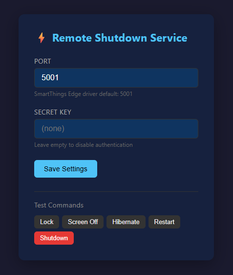

<div align="center">

# ⚡ SmartThings PC Control

**Windows PC 전원을 SmartThings로 제어하는 경량 서비스**

[](https://github.com/Protomothis/smartthings-pc-control/releases)
[](https://go.dev)
[](LICENSE)
[](https://www.microsoft.com/windows)

[한국어](#한국어) · [English](#english)



</div>

---

## 한국어

### 소개

[Remote Shutdown Manager (Karpach)](https://github.com/karpach/remote-shutdown-pc)의 완전 대체품으로, [PCControl Edge 드라이버](https://github.com/toddaustin07/PCControl)와 100% 호환됩니다.

| 기존 (Remote Shutdown Manager) | 이 프로젝트 |
|-------------------------------|------------|
| 유저 로그인 + 데스크톱 세션 필수 | **Windows 서비스** → 로그인 불필요 |
| .NET Framework 4.8 런타임 필요 | **단일 exe** → 런타임 없음 |
| 유저 로그아웃 시 동작 중지 | 항상 실행 |
| 설정 변경 시 재시작 필요 | **핫 리로드** (secret 즉시 반영) |

### 주요 기능

🎮 **8개 전원 명령** — shutdown, restart, hibernate, suspend, lock, screen off 등  
🌐 **Web UI** — 브라우저에서 설정, 테스트, 로그 확인  
⏱️ **예약 종료** — N분 후 자동 실행 (카운트다운 표시)  
📡 **WoL 상태** — 어댑터별 Wake-on-LAN 상태, MAC, IP, 외부 IP 표시  
🌍 **다국어** — 한국어/영어 (브라우저 감지 + 수동 전환)  
🌓 **다크/라이트 모드** — 시스템 테마 감지 + 수동 전환  
🔒 **보안** — secret 인증, CSRF 보호, 로그인 rate limiting  

### 지원 명령

| 명령 | 동작 |
|------|------|
| `ping` | 상태 확인 (200 OK) |
| `shutdown` | 종료 (5초 대기) |
| `forceshutdown` | 즉시 강제 종료 |
| `restart` | 재시작 (5초 대기) |
| `hibernate` | 최대 절전 모드 |
| `suspend` | 절전 모드 (슬립) |
| `lock` | 모든 활성 세션 잠금 |
| `turnscreenoff` | 모니터 끄기 * |

> \* `turnscreenoff`은 유저가 로그인된 상태에서만 동작합니다.

### 설치

**방법 1: 더블클릭 (GUI)**

exe 파일을 더블클릭하면 서비스 관리 패널이 열립니다.  
Install 버튼 클릭 → UAC 승인 → 설치 완료.

**방법 2: CLI**

```
smartthings-pc-control.exe install
```

어느 방법이든 서비스 등록 + 방화벽 규칙 + 자동 시작 모두 자동으로 처리됩니다.

#### 권장 설치 위치

```
C:\Program Files\SmartThings PC Control\smartthings-pc-control.exe
```

> ⚠️ exe와 같은 폴더에 `config.json`과 `service.log`가 생성됩니다. install 후 exe를 이동하면 서비스가 동작하지 않습니다.

### 사용법

**GUI (더블클릭)**

서비스 상태 확인, Install/Uninstall/Start, WebUI 열기를 GUI에서 할 수 있습니다.

**CLI**

```bash
smartthings-pc-control.exe install     # 서비스 설치 + 시작
smartthings-pc-control.exe uninstall   # 서비스 제거
smartthings-pc-control.exe status      # 상태 확인
smartthings-pc-control.exe version     # 버전 확인
smartthings-pc-control.exe run         # 콘솔 모드 (디버그)
```

### Web UI

설치 후: **http://127.0.0.1:5002**

- ⚙️ 포트, 시크릿 키 설정
- 🎮 명령어 테스트
- 📡 네트워크/WoL 상태 확인
- ⏱️ 예약 종료 설정
- 📋 실시간 로그 뷰어

### 설정

`config.json` (exe와 같은 폴더에 자동 생성):

```json
{
  "port": 5001,
  "secret": ""
}
```

| 키 | 설명 | 기본값 |
|----|------|--------|
| `port` | SmartThings Hub 요청 수신 포트 | 5001 |
| `secret` | 인증 키 (비어있으면 인증 없음) | "" |

> secret 변경은 서비스 재시작 없이 즉시 반영됩니다. 포트 변경만 재시작 필요.

### SmartThings 설정

1. SmartThings Hub에 [PCControl Edge 드라이버](https://github.com/toddaustin07/PCControl) 설치
2. 디바이스 설정에서 PC의 IP 주소 입력
3. 포트와 시크릿을 이 서비스와 동일하게 설정

> 기존에 Remote Shutdown Manager를 사용하고 있었다면 **SmartThings 쪽은 아무것도 바꿀 필요 없습니다.**

### 지원 환경

- **Windows 8 ~ 11** (WoL 상태 표시 포함)
- Windows 7 SP1 (핵심 기능만, WoL 미지원)
- 단일 exe, 외부 의존성 없음

> ℹ️ Windows 11에서 테스트되었습니다. Windows 10 이하는 호환성 테스트가 필요합니다.

### 빌드

```bash
go build -ldflags="-s -w -X main.Version=v0.3.0" -o smartthings-pc-control.exe .
```

---

## English

### About

Drop-in replacement for [Remote Shutdown Manager (Karpach)](https://github.com/karpach/remote-shutdown-pc), fully compatible with the [PCControl Edge driver](https://github.com/toddaustin07/PCControl).

| Original (Remote Shutdown Manager) | This Project |
|------------------------------------|-------------|
| Requires user login + desktop session | **Windows service** → no login needed |
| Requires .NET Framework 4.8 | **Single exe** → no runtime |
| Stops when user logs out | Always running |
| Restart required for config changes | **Hot reload** (secret applies instantly) |

### Features

🎮 **8 power commands** — shutdown, restart, hibernate, suspend, lock, screen off, etc.  
🌐 **Web UI** — configure, test, and monitor from your browser  
⏱️ **Scheduled shutdown** — auto-execute after N minutes (countdown display)  
📡 **WoL status** — per-adapter Wake-on-LAN state, MAC, IP, external IP  
🌍 **Multilingual** — Korean/English (auto-detect + manual toggle)  
🌓 **Dark/Light mode** — follows system theme + manual toggle  
🔒 **Security** — secret auth, CSRF protection, login rate limiting  

### Supported Commands

| Command | Action |
|---------|--------|
| `ping` | Health check (200 OK) |
| `shutdown` | Graceful shutdown (5s delay) |
| `forceshutdown` | Immediate forced shutdown |
| `restart` | Restart (5s delay) |
| `hibernate` | Hibernate |
| `suspend` | Suspend (sleep) |
| `lock` | Lock all active sessions |
| `turnscreenoff` | Turn off monitor * |

> \* `turnscreenoff` only works when a user is logged in.

### Installation

**Option 1: Double-click (GUI)**

Double-click the exe to open the service manager panel.  
Click Install → approve UAC → done.

**Option 2: CLI**

```
smartthings-pc-control.exe install
```

Either way, service registration, firewall rules, and auto-start are all handled automatically.

#### Recommended Location

```
C:\Program Files\SmartThings PC Control\smartthings-pc-control.exe
```

> ⚠️ `config.json` and `service.log` are created next to the exe. Moving the exe after install will break the service.

### Usage

**GUI (double-click)**

Check service status, Install/Uninstall/Start, and open WebUI from the GUI panel.

**CLI**

```bash
smartthings-pc-control.exe install     # Install and start service
smartthings-pc-control.exe uninstall   # Remove service
smartthings-pc-control.exe status      # Show status
smartthings-pc-control.exe version     # Show version
smartthings-pc-control.exe run         # Console mode (debug)
```

### Web UI

After installation: **http://127.0.0.1:5002**

- ⚙️ Port and secret key configuration
- 🎮 Command testing
- 📡 Network/WoL status monitoring
- ⏱️ Scheduled shutdown setup
- 📋 Real-time log viewer

### Configuration

`config.json` (auto-created next to exe):

```json
{
  "port": 5001,
  "secret": ""
}
```

| Key | Description | Default |
|-----|-------------|---------|
| `port` | Port for SmartThings Hub requests | 5001 |
| `secret` | Auth key (empty = no auth) | "" |

> Secret changes apply instantly without restart. Only port changes require a restart.

### SmartThings Setup

1. Install the [PCControl Edge driver](https://github.com/toddaustin07/PCControl) on your SmartThings Hub
2. Set your PC's IP address in device settings
3. Match port and secret with this service

> If you were already using Remote Shutdown Manager, **no changes needed on the SmartThings side.**

### System Requirements

- **Windows 8 ~ 11** (including WoL status)
- Windows 7 SP1 (core features only, no WoL)
- Single executable, no external dependencies

> ℹ️ Tested on Windows 11. Compatibility testing is needed for Windows 10 and below.

### Building

```bash
go build -ldflags="-s -w -X main.Version=v0.3.0" -o smartthings-pc-control.exe .
```

---

## License

[MIT](LICENSE)
