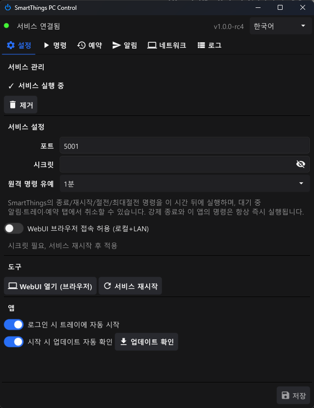
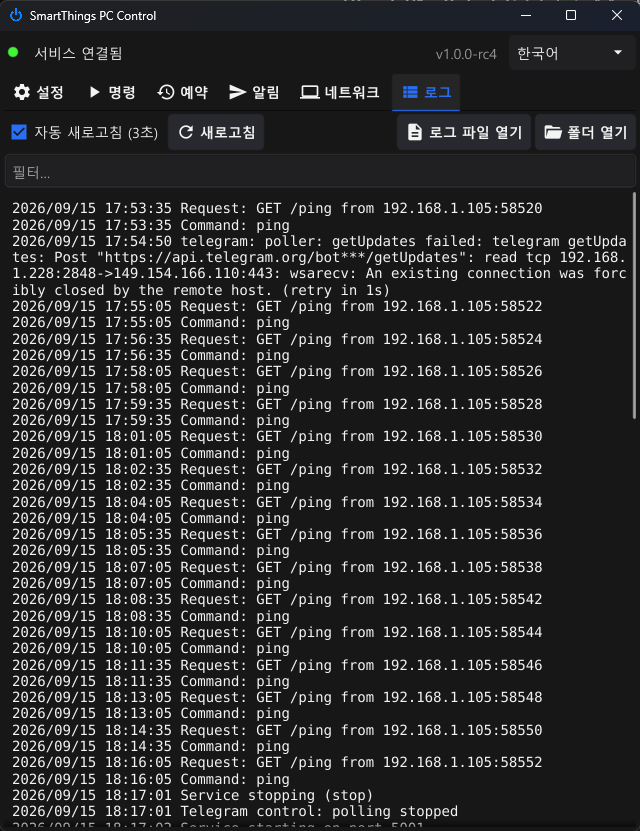
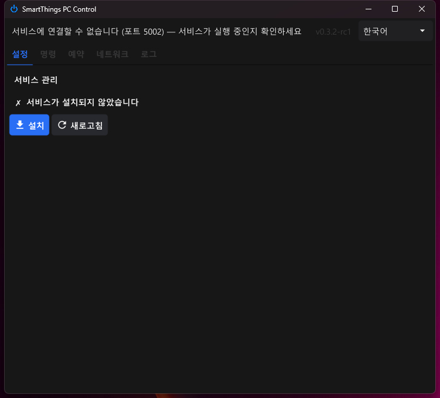
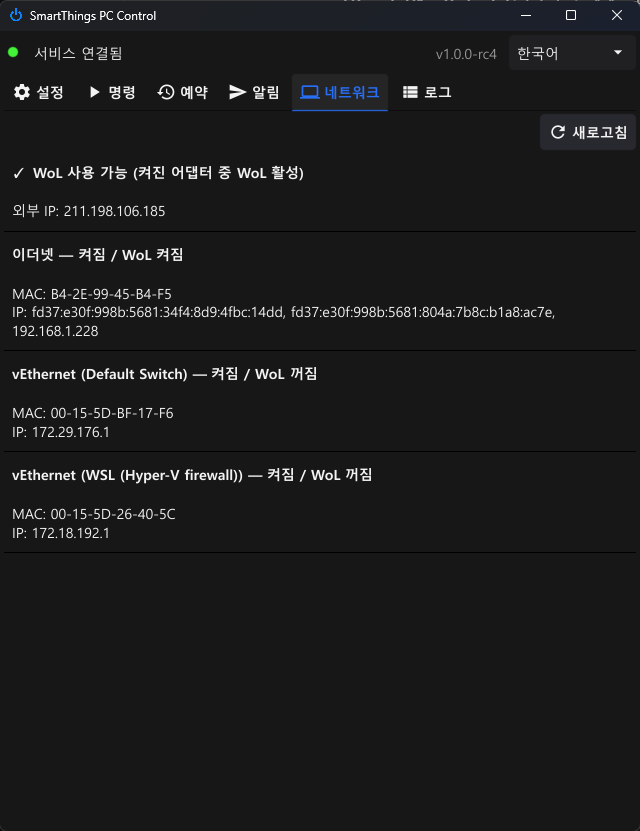
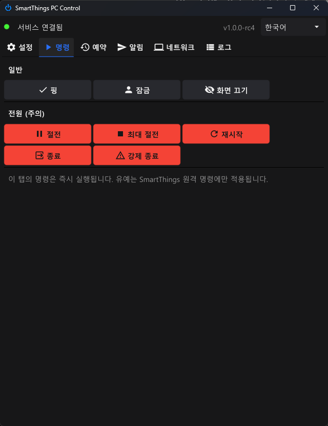
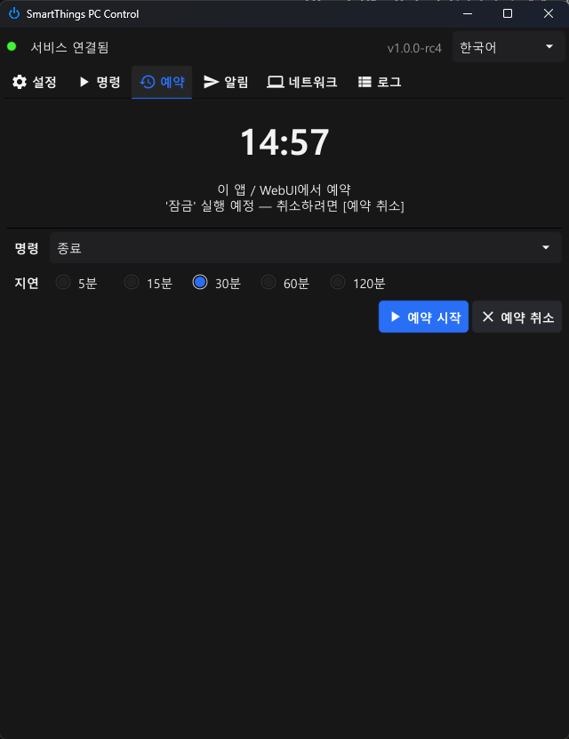

<div align="center">

# ⚡ SmartThings PC Control

**Windows PC 전원을 SmartThings로 제어하는 경량 서비스**

[](https://github.com/Protomothis/smartthings-pc-control/releases)
[](https://go.dev)
[](LICENSE)
[](https://www.microsoft.com/windows)

[한국어](#한국어) · [English](#english)

 

</div>

---

## 한국어

### 소개

[Remote Shutdown Manager (Karpach)](https://github.com/karpach/remote-shutdown-pc)의 완전 대체품으로, [PCControl Edge 드라이버](https://github.com/toddaustin07/PCControl)와 100% 호환됩니다.

| 기존 (Remote Shutdown Manager) | 이 프로젝트 |
|-------------------------------|------------|
| 유저 로그인 + 데스크톱 세션 필수 | **Windows 서비스** → 로그인 불필요 |
| .NET Framework 4.8 런타임 필요 | **단일 exe** → 런타임 없음 |
| 유저 로그아웃 시 동작 중지 | 항상 실행 |
| 설정 변경 시 재시작 필요 | **핫 리로드** (secret 즉시 반영) |

### 주요 기능

🖥️ **네이티브 데스크톱 앱** — 설정/명령/예약/네트워크/로그 탭, 트레이 상주  
🎮 **8개 전원 명령** — shutdown, restart, hibernate, suspend, lock, screen off 등  
🛡️ **전원 명령 5분 유예** — 종료/재시작/절전/최대절전을 5분 뒤 실행, 알림으로 취소 가능 (설정으로 끄기 가능)  
🌐 **Web UI (선택)** — 설정에서 허용 시 로컬/LAN 브라우저에서 접속  
⏱️ **예약 종료** — N분 후 자동 실행 (카운트다운 표시)  
📡 **WoL 상태** — 어댑터별 Wake-on-LAN 상태, MAC, IP, 외부 IP 표시  
🔔 **업데이트 확인** — 새 릴리스 자동 확인 및 알림  
🌍 **다국어** — 한국어/영어 (OS 언어 감지 + 수동 전환)  
🌓 **다크/라이트 모드** — 시스템 테마 감지  
🔒 **보안** — secret 인증, CSRF 보호, 로그인 rate limiting, WebUI 기본 비활성  

### 지원 명령

| 명령 | 동작 |
|------|------|
| `ping` | 상태 확인 (200 OK) |
| `shutdown` | 종료 (5초 대기) |
| `forceshutdown` | 즉시 강제 종료 |
| `restart` | 재시작 (5초 대기) |
| `hibernate` | 최대 절전 모드 |
| `suspend` | 절전 모드 (슬립) |
| `lock` | 모든 활성 세션 잠금 |
| `turnscreenoff` | 모니터 끄기 * |

> \* `turnscreenoff`은 유저가 로그인된 상태에서만 동작합니다.

### 설치

**방법 1: 더블클릭 (앱)**

exe 파일을 더블클릭하면 데스크톱 앱이 열립니다.  
설정 탭 → 서비스 관리 → [설치] 클릭 → UAC 승인 → 완료.  
설치가 끝나면 앱이 서비스를 자동으로 인식합니다 (새로고침 불필요).



**방법 2: CLI**

```
smartthings-pc-control.exe install
```

어느 방법이든 서비스 등록 + 방화벽 규칙 + 자동 시작 모두 자동으로 처리됩니다.

#### 권장 설치 위치

```
C:\Program Files\SmartThings PC Control\smartthings-pc-control.exe
```

> ⚠️ exe와 같은 폴더에 `config.json`과 `service.log`가 생성됩니다. install 후 exe를 이동하면 서비스가 동작하지 않습니다.

### 사용법

**데스크톱 앱 (더블클릭)**

- 5개 탭: 설정 / 명령 / 예약 / 네트워크 / 로그
- 서비스 관리: 설치·시작·제거 (상태 자동 감지)
- 창을 닫으면 **시스템 트레이로 최소화**됩니다. 완전 종료는 트레이 우클릭 → 종료
- 트레이 아이콘 **왼쪽 클릭 = 창 열기**, **오른쪽 클릭 = 메뉴** (열기, 상태, 빠른 명령(잠금/화면 끄기), 예약 취소, WebUI 열기, 종료)
- 언어: OS 언어 자동 감지, 우측 상단에서 한국어/영어 전환 (설정값과 연결 상태는 그대로 유지)

 

**CLI**

```bash
smartthings-pc-control.exe install     # 서비스 설치 + 시작
smartthings-pc-control.exe uninstall   # 서비스 제거
smartthings-pc-control.exe status      # 상태 확인
smartthings-pc-control.exe version     # 버전 확인
smartthings-pc-control.exe run         # 콘솔 모드 (디버그)
smartthings-pc-control.exe gui         # 데스크톱 앱 실행 (더블클릭과 동일)
```

### 원격 전원 명령 유예 (v0.3.2+)

SmartThings에서 종료/재시작/절전/최대절전 명령이 오면 **5분 뒤에 실행**되며, 그동안 Windows 알림이 표시됩니다. 알림의 **[바로 실행] / [취소]** 버튼으로 즉시 처리하거나, 트레이 메뉴·앱의 예약 탭에서 취소할 수 있습니다.

- **유예는 원격(SmartThings) 명령에만 적용됩니다** — 앱/WebUI에서 버튼으로 직접 실행하는 명령은 항상 즉시 실행
- 강제 종료(forceshutdown)는 원격이라도 항상 즉시 실행됩니다 (비상용)
- 원격 명령도 즉시 실행하고 싶으면 설정에서 유예를 끄세요 (`shutdown_grace: false`)
- SmartThings 명령 수신(포트 5001)은 WebUI 브라우저 접속 허용 여부와 무관하게 항상 열려 있습니다



### Web UI (선택)

브라우저 WebUI는 **기본 비활성**입니다. 데스크톱 앱 설정에서 "WebUI 브라우저 접속 허용"을 켜고 시크릿을 설정한 뒤 서비스를 재시작하면 로컬/LAN에서 **http://<PC-IP>:5002** 로 접속할 수 있습니다 (5002 방화벽 규칙 자동 관리).

- ⚙️ 포트, 시크릿 키 설정
- 🎮 명령어 테스트
- 📡 네트워크/WoL 상태 확인
- ⏱️ 예약 종료 설정
- 📋 실시간 로그 뷰어

### 설정

`config.json` (exe와 같은 폴더에 자동 생성):

```json
{
  "port": 5001,
  "secret": "",
  "webui_remote": false,
  "shutdown_grace": true
}
```

| 키 | 설명 | 기본값 |
|----|------|--------|
| `port` | SmartThings Hub 요청 수신 포트 | 5001 |
| `secret` | 인증 키 (비어있으면 인증 없음) | "" |
| `webui_remote` | 브라우저 WebUI 허용 (로컬+LAN, 시크릿 필수) | false |
| `shutdown_grace` | 전원 명령 5분 유예 | true |

> secret 변경은 서비스 재시작 없이 즉시 반영됩니다. 포트/`webui_remote` 변경은 재시작 필요.

### 업그레이드 (v0.3.x → v0.3.2)

1. 서비스 중지 후 exe 교체 → 서비스 시작 (재설치 불필요)
2. 기존 config.json 그대로 호환 — 새 키는 기본값으로 동작
3. 동작 변화: 브라우저 WebUI 기본 꺼짐, 전원 명령 5분 유예 기본 켜짐 (둘 다 설정 가능)

### SmartThings 설정

1. SmartThings Hub에 [PCControl Edge 드라이버](https://github.com/toddaustin07/PCControl) 설치
2. 디바이스 설정에서 PC의 IP 주소 입력
3. 포트와 시크릿을 이 서비스와 동일하게 설정

> 기존에 Remote Shutdown Manager를 사용하고 있었다면 **SmartThings 쪽은 아무것도 바꿀 필요 없습니다.**

### 지원 환경

- **Windows 10 ~ 11** 권장 (데스크톱 앱은 OpenGL 2.0 필요)
- 서비스 핵심 기능(명령 수신)은 Windows 8에서도 동작하나 미검증
- 단일 exe, 외부 런타임 없음

> ℹ️ Windows 11에서 테스트되었습니다. Windows 10 이하는 호환성 테스트가 필요합니다.

### 빌드

Fyne(네이티브 GUI) 때문에 CGO와 MinGW-w64 gcc가 필요합니다.

```bash
CGO_ENABLED=1 go build -ldflags="-s -w -H=windowsgui -X main.Version=v0.3.2" -o smartthings-pc-control.exe .
```

> `-H=windowsgui`: GUI 실행 시 콘솔창을 띄우지 않습니다 (CLI 출력은 부모 콘솔에 연결됨).

---

## English

### About

Drop-in replacement for [Remote Shutdown Manager (Karpach)](https://github.com/karpach/remote-shutdown-pc), fully compatible with the [PCControl Edge driver](https://github.com/toddaustin07/PCControl).

| Original (Remote Shutdown Manager) | This Project |
|------------------------------------|-------------|
| Requires user login + desktop session | **Windows service** → no login needed |
| Requires .NET Framework 4.8 | **Single exe** → no runtime |
| Stops when user logs out | Always running |
| Restart required for config changes | **Hot reload** (secret applies instantly) |

### Features

🖥️ **Native desktop app** — Settings/Commands/Schedule/Network/Logs tabs, system tray resident  
🎮 **8 power commands** — shutdown, restart, hibernate, suspend, lock, screen off, etc.  
🛡️ **5-minute grace period** — shutdown/restart/suspend/hibernate run after 5 min with a cancel notification (configurable)  
🌐 **Web UI (optional)** — enable in settings for local/LAN browser access  
⏱️ **Scheduled shutdown** — auto-execute after N minutes (countdown display)  
📡 **WoL status** — per-adapter Wake-on-LAN state, MAC, IP, external IP  
🔔 **Update check** — automatic new-release notifications  
🌍 **Multilingual** — Korean/English (auto-detect + manual toggle)  
🌓 **Dark/Light mode** — follows system theme  
🔒 **Security** — secret auth, CSRF protection, login rate limiting, WebUI off by default  

### Supported Commands

| Command | Action |
|---------|--------|
| `ping` | Health check (200 OK) |
| `shutdown` | Graceful shutdown (5s delay) |
| `forceshutdown` | Immediate forced shutdown |
| `restart` | Restart (5s delay) |
| `hibernate` | Hibernate |
| `suspend` | Suspend (sleep) |
| `lock` | Lock all active sessions |
| `turnscreenoff` | Turn off monitor * |

> \* `turnscreenoff` only works when a user is logged in.

### Installation

**Option 1: Double-click (app)**

Double-click the exe to open the desktop app.  
Settings tab → Service Management → Install → approve UAC → done.  
The app detects the freshly installed service by itself — no refresh needed.


**Option 2: CLI**

```
smartthings-pc-control.exe install
```

Either way, service registration, firewall rules, and auto-start are all handled automatically.

#### Recommended Location

```
C:\Program Files\SmartThings PC Control\smartthings-pc-control.exe
```

> ⚠️ `config.json` and `service.log` are created next to the exe. Moving the exe after install will break the service.

### Usage

**Desktop app (double-click)**

- Five tabs: Settings / Commands / Schedule / Network / Logs
- Built-in service management: install, start, uninstall (auto-detected state)
- Closing the window **minimizes to the system tray**. Exit via tray right-click → Exit
- Tray icon: **left click = open window**, **right click = menu** (Open, status, quick commands (lock/screen off), cancel schedule, open WebUI, Exit)
- Language: follows the OS language; switch Korean/English from the top-right (settings and connection state are kept)

 

**CLI**

```bash
smartthings-pc-control.exe install     # Install and start service
smartthings-pc-control.exe uninstall   # Remove service
smartthings-pc-control.exe status      # Show status
smartthings-pc-control.exe version     # Show version
smartthings-pc-control.exe run         # Console mode (debug)
smartthings-pc-control.exe gui         # Launch the desktop app (same as double-click)
```

### Remote power command grace period (v0.3.2+)

Shutdown/restart/suspend/hibernate commands from SmartThings run **after 5 minutes**, with a Windows notification during the wait — use its **[Run now] / [Cancel]** buttons, the tray menu, or the app's Schedule tab.

- **The grace period applies only to remote (SmartThings) commands** — buttons in the app/WebUI always run immediately
- Force shutdown always runs immediately, even remotely (emergency escape hatch)
- Prefer immediate remote execution? Turn off the grace toggle in settings (`shutdown_grace: false`)
- The SmartThings command listener (port 5001) is always reachable, regardless of the browser WebUI toggle


### Web UI (optional)

The browser WebUI is **disabled by default**. Enable "Allow browser access" in the desktop app settings, set a secret, and restart the service — then browse to **http://<pc-ip>:5002** from local or LAN (the 5002 firewall rule is managed automatically).

- ⚙️ Port and secret key configuration
- 🎮 Command testing
- 📡 Network/WoL status monitoring
- ⏱️ Scheduled shutdown setup
- 📋 Real-time log viewer

### Configuration

`config.json` (auto-created next to exe):

```json
{
  "port": 5001,
  "secret": "",
  "webui_remote": false,
  "shutdown_grace": true
}
```

| Key | Description | Default |
|-----|-------------|---------|
| `port` | Port for SmartThings Hub requests | 5001 |
| `secret` | Auth key (empty = no auth) | "" |
| `webui_remote` | Allow browser WebUI (local+LAN, secret required) | false |
| `shutdown_grace` | 5-min grace for power commands | true |

> Secret changes apply instantly without restart. Port and `webui_remote` changes require a restart.

### Upgrading (v0.3.x → v0.3.2)

1. Stop the service, replace the exe, start the service (no reinstall needed)
2. Existing config.json stays compatible — new keys use their defaults
3. Behavior changes: browser WebUI off by default, 5-min power grace on by default (both configurable)

### SmartThings Setup

1. Install the [PCControl Edge driver](https://github.com/toddaustin07/PCControl) on your SmartThings Hub
2. Set your PC's IP address in device settings
3. Match port and secret with this service

> If you were already using Remote Shutdown Manager, **no changes needed on the SmartThings side.**

### System Requirements

- **Windows 10 ~ 11** recommended (the desktop app needs OpenGL 2.0)
- The core service (command listener) may work on Windows 8, untested
- Single executable, no external runtime

> ℹ️ Tested on Windows 11. Compatibility testing is needed for Windows 10 and below.

### Building

CGO and a MinGW-w64 gcc are required (Fyne native GUI).

```bash
CGO_ENABLED=1 go build -ldflags="-s -w -H=windowsgui -X main.Version=v0.3.2" -o smartthings-pc-control.exe .
```

> `-H=windowsgui`: no console window for GUI launches (CLI output still reaches the parent console).

---

## License

[MIT](LICENSE)
