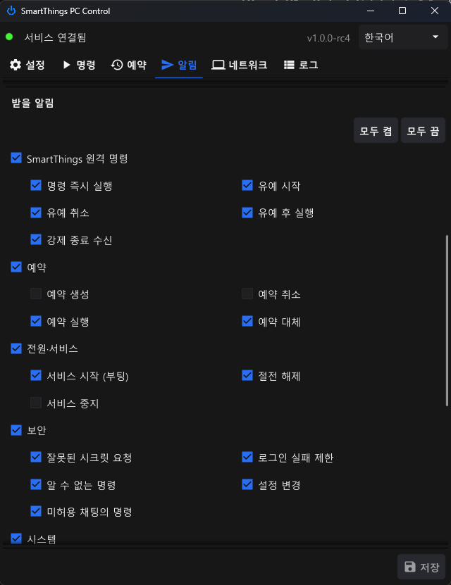

<div align="center">

# ⚡ SmartThings PC Control

**Windows PC 전원을 SmartThings로 제어하는 경량 서비스**

[](https://github.com/Protomothis/smartthings-pc-control/releases)
[](https://go.dev)
[](LICENSE)
[](https://www.microsoft.com/windows)

[한국어](#한국어) · [English](#english)

 

</div>

---

## 한국어

### 소개

[Remote Shutdown Manager (Karpach)](https://github.com/karpach/remote-shutdown-pc)의 완전 대체품으로, [PCControl Edge 드라이버](https://github.com/toddaustin07/PCControl)와 100% 호환됩니다.

| 기존 (Remote Shutdown Manager) | 이 프로젝트 |
|-------------------------------|------------|
| 유저 로그인 + 데스크톱 세션 필수 | **Windows 서비스** → 로그인 불필요 |
| .NET Framework 4.8 런타임 필요 | **단일 exe** → 런타임 없음 |
| 유저 로그아웃 시 동작 중지 | 항상 실행 |
| 설정 변경 시 재시작 필요 | **핫 리로드** (secret 즉시 반영) |

### 주요 기능

🖥️ **네이티브 데스크톱 앱** — 설정/명령/예약/알림/네트워크/로그 탭, 트레이 상주  
🎮 **8개 전원 명령** — shutdown, restart, hibernate, suspend, lock, screen off 등  
📨 **텔레그램 알림** (v1.0.0+) — 원격 명령·예약·전원·보안·시스템 이벤트를 카테고리별로 골라 받기, 조용한 시간대와 요약, HTML 템플릿 메시지  
🤖 **텔레그램에서 제어** (v1.0.0+) — `/status` `/menu` `/shutdown 30` 같은 명령과 인라인 버튼으로 PC 제어, 유예 알림의 [바로 실행]/[취소] 버튼  
🛡️ **전원 명령 유예** — 종료/재시작/절전/최대절전을 선택한 시간(10초~30분, 기본 5분) 뒤 실행, 알림으로 취소 가능 (끄기 가능)  
🌐 **Web UI (선택)** — 설정에서 허용 시 로컬/LAN 브라우저에서 접속  
⏱️ **예약 종료** — 5/15/30/60/120분 뒤 자동 실행 (큰 카운트다운 표시)  
📡 **WoL 상태** — 어댑터별 Wake-on-LAN 상태, MAC, IP, 외부 IP 표시  
🔔 **업데이트 확인** — 새 릴리스 자동 확인 및 알림  
🌍 **다국어** — 한국어/영어 (OS 언어 감지 + 수동 전환)  
🌓 **다크/라이트 모드** — 시스템 테마 감지  
🔒 **보안** — secret 인증, CSRF 보호, 로그인 rate limiting, WebUI 기본 비활성  

### 지원 명령

| 명령 | 동작 |
|------|------|
| `ping` | 상태 확인 (200 OK) |
| `shutdown` | 종료 (5초 대기) |
| `forceshutdown` | 즉시 강제 종료 |
| `restart` | 재시작 (5초 대기) |
| `hibernate` | 최대 절전 모드 |
| `suspend` | 절전 모드 (슬립) |
| `lock` | 모든 활성 세션 잠금 |
| `turnscreenoff` | 모니터 끄기 * |

> \* `turnscreenoff`은 유저가 로그인된 상태에서만 동작합니다.

### 설치

**방법 1: 더블클릭 (앱)**

exe 파일을 더블클릭하면 데스크톱 앱이 열립니다.  
설정 탭 → 서비스 관리 → [설치] 클릭 → UAC 승인 → 완료.  
설치가 끝나면 앱이 서비스를 자동으로 인식합니다 (새로고침 불필요).


**방법 2: CLI**

```
smartthings-pc-control.exe install
```

어느 방법이든 서비스 등록 + 방화벽 규칙 + 자동 시작 모두 자동으로 처리됩니다.

#### 권장 설치 위치

```
C:\Program Files\SmartThings PC Control\smartthings-pc-control.exe
```

> ⚠️ exe와 같은 폴더에 `config.json`과 `service.log`가 생성됩니다. install 후 exe를 이동하면 서비스가 동작하지 않습니다. 다운로드·바탕 화면·문서·임시 폴더에서 [설치]를 누르면 앱이 경고를 표시합니다 (v0.3.3+).

### 사용법

**데스크톱 앱 (더블클릭)**

- 6개 탭(아이콘 포함): 설정 / 명령 / 예약 / 알림 / 네트워크 / 로그 — 예약은 프리셋(5/15/30/60/120분)만 선택, 알림 탭에서 텔레그램 연결과 받을 알림 선택, 로그 필터와 로그 파일·폴더 열기, 변경 시에만 활성화되는 저장 버튼. 상단 상태 표시줄의 색 점이 연결 상태(연결/끊김/연결 중)를 보여줍니다
- 서비스 관리: 설치·시작·제거 (상태 자동 감지)
- 창을 닫으면 **시스템 트레이로 최소화**됩니다. 완전 종료는 트레이 우클릭 → 종료
- 트레이 아이콘 **왼쪽 클릭 = 창 열기**, **오른쪽 클릭 = 메뉴** (열기, 상태, 빠른 명령(잠금/화면 끄기), 예약 취소, WebUI 열기, 종료). 툴팁과 상태 항목에 연결 상태·예약 남은 시간 표시
- 언어: OS 언어 자동 감지, 우측 상단에서 한국어/영어 전환 (설정값과 연결 상태는 그대로 유지)
- **로그인 시 자동 시작** (v0.3.3+): 앱을 한 번 실행하면 이후 로그인 때 창 없이 트레이에만 상주합니다. 유예 알림을 받으려면 켜 두세요. 설정 탭 → 앱에서 끌 수 있습니다

 

**CLI**

```bash
smartthings-pc-control.exe install     # 서비스 설치 + 시작
smartthings-pc-control.exe uninstall   # 서비스 제거
smartthings-pc-control.exe status      # 상태 확인
smartthings-pc-control.exe version     # 버전 확인
smartthings-pc-control.exe run         # 콘솔 모드 (디버그)
smartthings-pc-control.exe gui         # 데스크톱 앱 실행 (더블클릭과 동일)
smartthings-pc-control.exe gui --minimized  # 창 없이 트레이에만 (로그인 자동 시작이 사용)
```

### 원격 전원 명령 유예 (v0.3.2+)

SmartThings에서 종료/재시작/절전/최대절전 명령이 오면 **설정한 유예 시간 뒤에 실행**되며(기본 5분), 그동안 Windows 알림이 표시됩니다. 알림의 **[바로 실행] / [취소]** 버튼으로 즉시 처리하거나, 트레이 메뉴·앱의 예약 탭에서 취소할 수 있습니다.

- **유예 시간 선택** (v0.3.4+): 설정 탭 → 서비스 설정 → "원격 명령 유예"에서 사용 안 함 / 10초 / 30초 / 1분 / 5분 / 10분 / 30분 중 선택 (`grace_seconds`)
- **출처 표시** (v0.3.4+): 예약 탭·트레이·토스트가 "SmartThings 원격 명령 · 유예 중"과 "이 앱 / WebUI에서 예약"을 구분합니다. 예약 슬롯은 하나라 새 예약이 기존 예약을 대체하며, 대체되면 그 사실이 표시됩니다
- **유예는 원격(SmartThings) 명령에만 적용됩니다** — 앱/WebUI에서 버튼으로 직접 실행하는 명령은 항상 즉시 실행
- 강제 종료(forceshutdown)는 원격이라도 항상 즉시 실행됩니다 (비상용)
- 원격 명령도 즉시 실행하고 싶으면 유예를 "사용 안 함"으로 두세요 (`shutdown_grace: false`)
- 트레이 앱이 꺼져 있어도 원격 유예 명령이 들어오면 서비스가 트레이 앱을 자동으로 실행해 토스트를 표시합니다 (로그인된 사용자 세션이 있어야 함, v0.3.3+)
- SmartThings 명령 수신(포트 5001)은 WebUI 브라우저 접속 허용 여부와 무관하게 항상 열려 있습니다


### 텔레그램 알림과 제어 (v1.0.0+)

서비스가 텔레그램 봇으로 이벤트를 보내고, 원하면 텔레그램에서 PC를 제어할 수도 있습니다. 봇 API 아웃바운드와 롱 폴링만 사용하므로 **포트 개방이나 웹훅이 필요 없습니다.** Windows 토스트 알림은 이 설정과 무관하게 그대로 동작합니다.

**연결**

1. 텔레그램에서 [@BotFather](https://t.me/BotFather)에게 `/newbot`을 보내 봇을 만들고 토큰을 받습니다
2. 새 봇에게 아무 메시지나 보냅니다 (봇이 채팅을 알 수 있어야 합니다)
3. 앱 → 알림 탭 → 봇 토큰을 붙여 넣고 **[Chat ID 찾기]** → 채팅을 선택 → **[테스트 발송]**으로 확인 → "텔레그램 알림 사용" 체크 → 저장

토큰은 config.json에 Windows DPAPI(머신 범위)로 암호화되어 저장되고(`dpapi:` 접두사), 앱과 API에는 마스킹된 값(`****1234`)만 보입니다.

 

**받을 알림** — 카테고리별로 켜고 끕니다. 기본값은 예약 생성·취소와 서비스 중지만 꺼져 있습니다.

| 카테고리 | 이벤트 |
|---|---|
| SmartThings 원격 명령 | 명령 즉시 실행, 유예 시작(버튼 포함), 유예 취소, 유예 후 실행, 강제 종료 수신 |
| 예약 | 예약 생성, 취소, 실행, 대체 |
| 전원·서비스 | 서비스 시작(부팅·WoL 복귀), 절전 해제, 서비스 중지 |
| 보안 | 잘못된 시크릿 요청(5분 창 집계), 로그인 실패 제한, 알 수 없는 명령, 설정 변경, 미허용 채팅의 명령 |
| 시스템 | 새 버전 있음, 업데이트 완료, 명령 실행 실패, 트레이 앱 깨우기 실패 |

`ping`은 절대 알리지 않습니다. 유예 시작 알림과 강제 종료는 취소 기회이므로 조용한 시간대에도 항상 전송됩니다.

**조용한 시간대** — 예: 22:00~07:00. 그 동안 걸러진 알림은 버리지 않고 모아 해제 시각에 요약 한 통으로 보냅니다. 보안 알림은 예외로 둘 수 있습니다. `/mute 2h`로 임시 뮤트도 됩니다.

**텔레그램에서 제어** — 알림 탭 → "텔레그램 명령으로 이 PC 제어 허용"을 켜면 허용된 Chat ID에서만 다음 명령을 받습니다 (기본 꺼짐). 미허용 채팅의 명령은 무시하고 보안 알림으로 보고합니다.

| 명령 | 동작 |
|---|---|
| `/status` | 버전, 가동 시간, 활성 예약, 마지막 원격 명령 |
| `/menu` | 잠금 / 화면 끄기 / 절전 / 재시작 / 종료 / 예약 취소 버튼 |
| `/lock` `/screenoff` | 즉시 실행 |
| `/sleep` `/hibernate` `/restart` `/shutdown [분]` | 분 없음: [확인] 버튼 후 즉시 실행. 분 있음: 예약 |
| `/cancel` `/now` | 활성 예약·유예 취소 / 즉시 실행 |
| `/mute 30m` `/mute 2h` `/unmute` | 알림 임시 중지 / 재개 |
| `/help` | 명령 목록 |

유예 알림 메시지의 **[바로 실행] / [취소]** 버튼은 Windows 토스트와 같은 동작을 하며, 처리되면 메시지가 "✅ 취소됨 · 14:32 · 텔레그램"처럼 결과 줄로 편집됩니다. 서비스 시작 전에 쌓인 명령은 버립니다.

### Web UI (선택)

브라우저 WebUI는 **기본 비활성**입니다. 데스크톱 앱 설정에서 "WebUI 브라우저 접속 허용"을 켜고 시크릿을 설정한 뒤 서비스를 재시작하면 로컬/LAN에서 **http://<PC-IP>:5002** 로 접속할 수 있습니다 (5002 방화벽 규칙 자동 관리).

- ⚙️ 포트, 시크릿 키 설정
- 🎮 명령어 테스트
- 📡 네트워크/WoL 상태 확인
- ⏱️ 예약 종료 설정
- 📋 실시간 로그 뷰어

### 설정

`config.json` (exe와 같은 폴더에 자동 생성):

```json
{
  "port": 5001,
  "secret": "",
  "webui_remote": false,
  "shutdown_grace": true,
  "grace_seconds": 300,
  "telegram": {
    "enabled": false,
    "bot_token": "dpapi:...",
    "chat_id": "",
    "control_enabled": false,
    "allowed_chat_ids": [],
    "detail": "full",
    "lang": "ko",
    "pc_name": "",
    "quiet_hours": { "enabled": false, "start": "22:00", "end": "07:00", "security_bypass": true, "digest": true }
  },
  "notify": { "remote": { "received": true, "grace_scheduled": true, "...": true }, "schedule": {}, "power": {}, "security": {}, "system": {} }
}
```

| 키 | 설명 | 기본값 |
|----|------|--------|
| `port` | SmartThings Hub 요청 수신 포트 | 5001 |
| `secret` | 인증 키 (비어있으면 인증 없음) | "" |
| `webui_remote` | 브라우저 WebUI 허용 (로컬+LAN, 시크릿 필수) | false |
| `shutdown_grace` | 원격 전원 명령 유예 켜기/끄기 | true |
| `grace_seconds` | 유예 시간(초), 5~3600. 앱은 10/30/60/300/600/1800 제공 (v0.3.4+) | 300 |
| `telegram.enabled` | 텔레그램 알림 발송 (v1.0.0+) | false |
| `telegram.bot_token` | 봇 토큰. 저장 시 DPAPI 암호화(`dpapi:`), 평문을 넣어도 다음 저장 때 암호화 | "" |
| `telegram.chat_id` | 알림을 받을 채팅 | "" |
| `telegram.control_enabled` | 텔레그램 명령으로 PC 제어 허용 | false |
| `telegram.allowed_chat_ids` | 명령을 낼 수 있는 채팅 목록 (비어 있으면 `chat_id`만) | [] |
| `telegram.detail` | 메시지 상세 수준 `simple` / `full` | full |
| `telegram.lang` | 메시지 언어 `ko` / `en` (앱 언어를 따라 저장됨) | ko |
| `telegram.pc_name` | 메시지 꼬리말의 PC 이름 (비어 있으면 호스트 이름) | "" |
| `telegram.quiet_hours` | 조용한 시간대 `{enabled, start, end, security_bypass, digest}` | 22:00~07:00, 꺼짐 |
| `notify.<카테고리>.<이벤트>` | 이벤트별 알림 on/off. 없는 키는 기본값 | 대부분 true |

> secret·텔레그램·알림 설정 변경은 서비스 재시작 없이 즉시 반영됩니다. 포트/`webui_remote` 변경은 재시작 필요.

### 업데이트 (v0.3.3+)

앱이 시작될 때(및 24시간마다) GitHub Releases에서 새 버전을 확인합니다. 새 버전이 있으면 알림 대화상자에서 **[지금 업데이트]**를 누르세요.

1. 새 exe를 exe 옆 `update\` 폴더(쓰기 불가 시 임시 폴더)에 다운로드하고 버전을 검증합니다
2. UAC 승인 창이 한 번 표시됩니다. 승인하면 앱이 종료되고 관리자 권한으로 서비스 중지 → 기존 exe를 `.old`로 보관 → 새 exe 복사 → 서비스 재시작이 진행됩니다
3. 새 버전 앱이 자동으로 다시 실행됩니다. 실패하면 이전 exe로 자동 롤백되며 상세 기록은 exe 옆 `gui.log`에 남습니다

설정 탭 → 도구의 **[업데이트 확인]** 버튼으로 수동 확인도 가능합니다. 이전 방식대로 릴리스 페이지에서 exe를 직접 받아 덮어써도 됩니다.

### 업그레이드 (v0.3.x → v1.0.0)

1. v0.3.3 이상이면 앱의 **[지금 업데이트]**로, 그 이전이면 서비스 중지 → exe 교체 → 서비스 시작 (재설치 불필요)
2. 기존 config.json 그대로 호환 — `telegram`/`notify` 키는 기본값으로 추가되며, 텔레그램은 설정하기 전까지 아무 것도 보내지 않습니다
3. 새로 생기는 파일: exe 옆 `state.json` (마지막 실행 버전, 마지막으로 알린 릴리스). 삭제해도 동작에 영향 없음
4. v0.3.2 이전에서 올라오는 경우의 동작 변화: 브라우저 WebUI 기본 꺼짐, 전원 명령 유예(기본 5분) 기본 켜짐 (둘 다 설정 가능)

### SmartThings 설정

1. SmartThings Hub에 [PCControl Edge 드라이버](https://github.com/toddaustin07/PCControl) 설치
2. 디바이스 설정에서 PC의 IP 주소 입력
3. 포트와 시크릿을 이 서비스와 동일하게 설정

> 기존에 Remote Shutdown Manager를 사용하고 있었다면 **SmartThings 쪽은 아무것도 바꿀 필요 없습니다.**

### 지원 환경

- **Windows 10 ~ 11** 권장 (데스크톱 앱은 OpenGL 2.0 필요)
- 서비스 핵심 기능(명령 수신)은 Windows 8에서도 동작하나 미검증
- 단일 exe, 외부 런타임 없음

> ℹ️ Windows 11에서 테스트되었습니다. Windows 10 이하는 호환성 테스트가 필요합니다.

### 빌드

Fyne(네이티브 GUI) 때문에 CGO와 MinGW-w64 gcc가 필요합니다.

```bash
CGO_ENABLED=1 go build -ldflags="-s -w -H=windowsgui -X main.Version=v0.3.2" -o smartthings-pc-control.exe .
```

> `-H=windowsgui`: GUI 실행 시 콘솔창을 띄우지 않습니다 (CLI 출력은 부모 콘솔에 연결됨).

---

## English

### About

Drop-in replacement for [Remote Shutdown Manager (Karpach)](https://github.com/karpach/remote-shutdown-pc), fully compatible with the [PCControl Edge driver](https://github.com/toddaustin07/PCControl).

| Original (Remote Shutdown Manager) | This Project |
|------------------------------------|-------------|
| Requires user login + desktop session | **Windows service** → no login needed |
| Requires .NET Framework 4.8 | **Single exe** → no runtime |
| Stops when user logs out | Always running |
| Restart required for config changes | **Hot reload** (secret applies instantly) |

### Features

🖥️ **Native desktop app** — Settings/Commands/Schedule/Notifications/Network/Logs tabs, system tray resident  
🎮 **8 power commands** — shutdown, restart, hibernate, suspend, lock, screen off, etc.  
📨 **Telegram notifications** (v1.0.0+) — pick remote-command, schedule, power, security and system events by category; quiet hours with a digest; HTML-templated messages  
🤖 **Control from Telegram** (v1.0.0+) — `/status`, `/menu`, `/shutdown 30` and inline buttons, including [Run now]/[Cancel] on grace notifications  
🛡️ **Power command grace period** — shutdown/restart/suspend/hibernate run after a chosen delay (10 s – 30 min, default 5 min) with a cancel notification (can be turned off)  
🌐 **Web UI (optional)** — enable in settings for local/LAN browser access  
⏱️ **Scheduled shutdown** — auto-execute after 5/15/30/60/120 minutes (large countdown display)  
📡 **WoL status** — per-adapter Wake-on-LAN state, MAC, IP, external IP  
🔔 **Update check** — automatic new-release notifications  
🌍 **Multilingual** — Korean/English (auto-detect + manual toggle)  
🌓 **Dark/Light mode** — follows system theme  
🔒 **Security** — secret auth, CSRF protection, login rate limiting, WebUI off by default  

### Supported Commands

| Command | Action |
|---------|--------|
| `ping` | Health check (200 OK) |
| `shutdown` | Graceful shutdown (5s delay) |
| `forceshutdown` | Immediate forced shutdown |
| `restart` | Restart (5s delay) |
| `hibernate` | Hibernate |
| `suspend` | Suspend (sleep) |
| `lock` | Lock all active sessions |
| `turnscreenoff` | Turn off monitor * |

> \* `turnscreenoff` only works when a user is logged in.

### Installation

**Option 1: Double-click (app)**

Double-click the exe to open the desktop app.  
Settings tab → Service Management → Install → approve UAC → done.  
The app detects the freshly installed service by itself — no refresh needed.


**Option 2: CLI**

```
smartthings-pc-control.exe install
```

Either way, service registration, firewall rules, and auto-start are all handled automatically.

#### Recommended Location

```
C:\Program Files\SmartThings PC Control\smartthings-pc-control.exe
```

> ⚠️ `config.json` and `service.log` are created next to the exe. Moving the exe after install will break the service. Installing from Downloads, Desktop, Documents or a temp folder triggers a warning in the app (v0.3.3+).

### Usage

**Desktop app (double-click)**

- Six tabs (with icons): Settings / Commands / Schedule / Notifications / Network / Logs — schedule delay is preset-only (5/15/30/60/120 min), the Notifications tab holds the Telegram connection and event selection, log filter with open-file/open-folder, Save enabled only when something changed. A coloured dot in the status bar shows the connection state (connected / lost / connecting)
- Built-in service management: install, start, uninstall (auto-detected state)
- Closing the window **minimizes to the system tray**. Exit via tray right-click → Exit
- Tray icon: **left click = open window**, **right click = menu** (Open, status, quick commands (lock/screen off), cancel schedule, open WebUI, Exit). Tooltip and status entry show connection state and remaining schedule time
- Language: follows the OS language; switch Korean/English from the top-right (settings and connection state are kept)
- **Start at login** (v0.3.3+): after the first launch the app starts in the tray (no window) on every login. Keep it on to receive grace-period toasts. Turn it off under Settings → App

 

**CLI**

```bash
smartthings-pc-control.exe install     # Install and start service
smartthings-pc-control.exe uninstall   # Remove service
smartthings-pc-control.exe status      # Show status
smartthings-pc-control.exe version     # Show version
smartthings-pc-control.exe run         # Console mode (debug)
smartthings-pc-control.exe gui         # Launch the desktop app (same as double-click)
smartthings-pc-control.exe gui --minimized  # Tray only, no window (used by login autostart)
```

### Remote power command grace period (v0.3.2+)

Shutdown/restart/suspend/hibernate commands from SmartThings run **after the configured grace period** (default 5 minutes), with a Windows notification during the wait — use its **[Run now] / [Cancel]** buttons, the tray menu, or the app's Schedule tab.

- **Choose the length** (v0.3.4+): Settings tab → Service Settings → "Remote grace": Off / 10 s / 30 s / 1 min / 5 min / 10 min / 30 min (`grace_seconds`)
- **Origin shown** (v0.3.4+): the Schedule tab, tray and toast distinguish "SmartThings remote command · grace period" from "Scheduled from this app / WebUI". There is a single schedule slot, so a new schedule replaces the current one and says so
- **The grace period applies only to remote (SmartThings) commands** — buttons in the app/WebUI always run immediately
- Force shutdown always runs immediately, even remotely (emergency escape hatch)
- Prefer immediate remote execution? Set the grace period to "Off" (`shutdown_grace: false`)
- If the tray app is not running when a remote grace command arrives, the service launches it in the logged-in user's session so the toast still appears (v0.3.3+)
- The SmartThings command listener (port 5001) is always reachable, regardless of the browser WebUI toggle


### Telegram notifications and control (v1.0.0+)

The service sends events to a Telegram bot and, if you enable it, accepts commands from Telegram. Only outbound Bot API calls and long polling are used — **no open ports, no webhook.** Windows toast notifications keep working independently of these settings.

**Connect**

1. In Telegram, send `/newbot` to [@BotFather](https://t.me/BotFather) and copy the token
2. Send any message to your new bot (so it can see the chat)
3. App → Notifications tab → paste the token → **[Find Chat ID]** → pick the chat → **[Send test]** → tick "Enable Telegram notifications" → Save

The token is stored in config.json encrypted with Windows DPAPI (machine scope, `dpapi:` prefix); the app and API only ever show a masked value (`****1234`).

 

**Notifications to receive** — toggled per category. By default only schedule created/cancelled and service stopping are off.

| Category | Events |
|---|---|
| SmartThings remote commands | command run immediately, grace period started (with buttons), grace cancelled, run after grace, force shutdown received |
| Schedules | created, cancelled, run, replaced |
| Power & service | service started (boot / WoL wake), resumed from sleep, service stopping |
| Security | bad secret request (aggregated in 5-minute windows), login rate-limited, unknown command, settings changed, command from an unknown chat |
| System | update available, updated, command failed, tray wake failed |

`ping` is never reported. Grace-started and force-shutdown alerts are your chance to cancel, so they are always delivered even during quiet hours.

**Quiet hours** — e.g. 22:00–07:00. Alerts held during that window are not dropped; one digest is sent when it ends. Security alerts can bypass it. `/mute 2h` gives a temporary mute.

**Control from Telegram** — turn on "Allow Telegram commands to control this PC" in the Notifications tab; only the allowed chat IDs are accepted (off by default). Commands from any other chat are ignored and reported as a security event.

| Command | Action |
|---|---|
| `/status` | version, uptime, active schedule, last remote command |
| `/menu` | buttons: lock / screen off / sleep / restart / shutdown / cancel schedule |
| `/lock` `/screenoff` | run immediately |
| `/sleep` `/hibernate` `/restart` `/shutdown [min]` | no minutes: [Confirm] button, then immediate; with minutes: scheduled |
| `/cancel` `/now` | cancel the active schedule/grace / run it now |
| `/mute 30m` `/mute 2h` `/unmute` | pause / resume alerts |
| `/help` | command list |

The **[Run now] / [Cancel]** buttons on a grace notification do the same as the Windows toast; once handled, the message is edited with a result line such as "✅ Cancelled · 14:32 · Telegram". Commands queued while the service was down are discarded.

### Web UI (optional)

The browser WebUI is **disabled by default**. Enable "Allow browser access" in the desktop app settings, set a secret, and restart the service — then browse to **http://<pc-ip>:5002** from local or LAN (the 5002 firewall rule is managed automatically).

- ⚙️ Port and secret key configuration
- 🎮 Command testing
- 📡 Network/WoL status monitoring
- ⏱️ Scheduled shutdown setup
- 📋 Real-time log viewer

### Configuration

`config.json` (auto-created next to exe):

```json
{
  "port": 5001,
  "secret": "",
  "webui_remote": false,
  "shutdown_grace": true,
  "grace_seconds": 300,
  "telegram": {
    "enabled": false,
    "bot_token": "dpapi:...",
    "chat_id": "",
    "control_enabled": false,
    "allowed_chat_ids": [],
    "detail": "full",
    "lang": "en",
    "pc_name": "",
    "quiet_hours": { "enabled": false, "start": "22:00", "end": "07:00", "security_bypass": true, "digest": true }
  },
  "notify": { "remote": { "received": true, "grace_scheduled": true, "...": true }, "schedule": {}, "power": {}, "security": {}, "system": {} }
}
```

| Key | Description | Default |
|-----|-------------|---------|
| `port` | Port for SmartThings Hub requests | 5001 |
| `secret` | Auth key (empty = no auth) | "" |
| `webui_remote` | Allow browser WebUI (local+LAN, secret required) | false |
| `shutdown_grace` | Grace period for remote power commands on/off | true |
| `grace_seconds` | Grace length in seconds, 5–3600; the app offers 10/30/60/300/600/1800 (v0.3.4+) | 300 |
| `telegram.enabled` | Send Telegram notifications (v1.0.0+) | false |
| `telegram.bot_token` | Bot token; DPAPI-encrypted on save (`dpapi:`), plaintext is re-encrypted on the next save | "" |
| `telegram.chat_id` | Chat that receives notifications | "" |
| `telegram.control_enabled` | Accept PC control commands from Telegram | false |
| `telegram.allowed_chat_ids` | Chats allowed to send commands (empty = `chat_id` only) | [] |
| `telegram.detail` | Message detail `simple` / `full` | full |
| `telegram.lang` | Message language `ko` / `en` (saved from the app language) | ko |
| `telegram.pc_name` | PC name in the message footer (empty = hostname) | "" |
| `telegram.quiet_hours` | `{enabled, start, end, security_bypass, digest}` | 22:00–07:00, off |
| `notify.<category>.<event>` | Per-event on/off; missing keys use the default | mostly true |

> Secret, Telegram and notification changes apply instantly without restart. Port and `webui_remote` changes require a restart.

### Updating (v0.3.3+)

On startup (and every 24 hours) the app checks GitHub Releases. When a newer version exists, click **Update now** in the notification dialog.

1. The new exe is downloaded to an `update\` folder next to the exe (or the temp folder if that is not writable) and its version is verified
2. A single UAC prompt appears. Once approved the app closes and, with admin rights, the service is stopped, the current exe is kept as `.old`, the new exe is copied into place and the service is restarted
3. The new version relaunches automatically. On failure the previous exe is restored and details are written to `gui.log` next to the exe

You can also check manually via Settings → Tools → **Check for updates**, or still download the exe from the release page and overwrite it by hand.

### Upgrading (v0.3.x → v1.0.0)

1. From v0.3.3 or later use **Update now** in the app; from older versions stop the service, replace the exe, start the service (no reinstall needed)
2. Existing config.json stays compatible — `telegram`/`notify` keys are added with defaults, and nothing is sent to Telegram until you configure it
3. New file next to the exe: `state.json` (last run version, last release notified). Safe to delete
4. Coming from before v0.3.2: browser WebUI is off by default and the power grace period (default 5 min) is on by default (both configurable)

### SmartThings Setup

1. Install the [PCControl Edge driver](https://github.com/toddaustin07/PCControl) on your SmartThings Hub
2. Set your PC's IP address in device settings
3. Match port and secret with this service

> If you were already using Remote Shutdown Manager, **no changes needed on the SmartThings side.**

### System Requirements

- **Windows 10 ~ 11** recommended (the desktop app needs OpenGL 2.0)
- The core service (command listener) may work on Windows 8, untested
- Single executable, no external runtime

> ℹ️ Tested on Windows 11. Compatibility testing is needed for Windows 10 and below.

### Building

CGO and a MinGW-w64 gcc are required (Fyne native GUI).

```bash
CGO_ENABLED=1 go build -ldflags="-s -w -H=windowsgui -X main.Version=v0.3.2" -o smartthings-pc-control.exe .
```

> `-H=windowsgui`: no console window for GUI launches (CLI output still reaches the parent console).

---

## License

[MIT](LICENSE)
