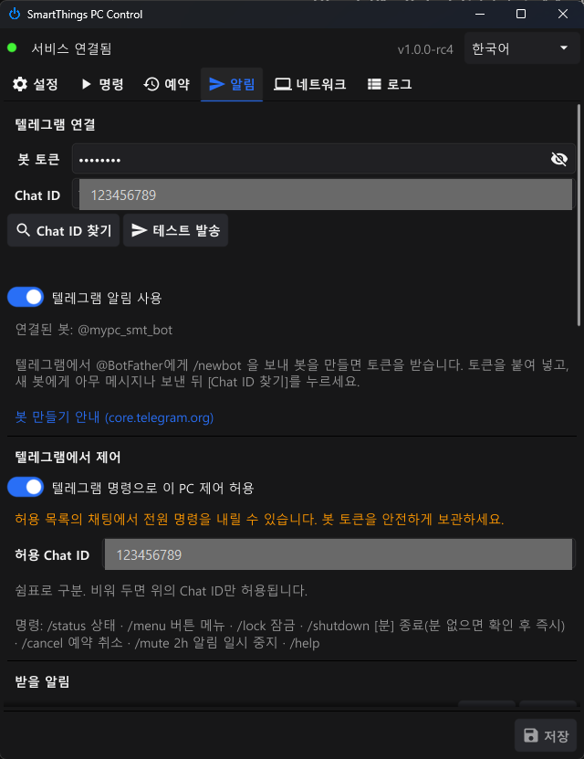

<div align="center">

# ⚡ SmartThings PC Control

**Windows PC 전원을 SmartThings와 텔레그램으로 제어하는 경량 서비스 + 트레이 앱**  
<sub>Control Windows PC power from SmartThings & Telegram — a Remote Shutdown Manager alternative for the PCControl Edge driver</sub>

[](https://github.com/Protomothis/smartthings-pc-control/releases)
[](https://go.dev)
[](LICENSE)
[](https://www.microsoft.com/windows)

[한국어](#한국어) · [English](#english)

 

</div>

---

## 한국어

### 소개

SmartThings PC Control은 SmartThings(그리고 원하면 텔레그램)에서 Windows PC의 전원을 제어하는 **Windows 서비스 + 트레이 앱**입니다. [Remote Shutdown Manager (Karpach)](https://github.com/karpach/remote-shutdown-pc)의 완전 대체품으로, [PCControl Edge 드라이버](https://github.com/toddaustin07/PCControl)와 100% 호환됩니다 — SmartThings 쪽은 바꿀 것이 없습니다.

| 기존 (Remote Shutdown Manager) | 이 프로젝트 |
|-------------------------------|------------|
| 유저 로그인 + 데스크톱 세션 필수 | **Windows 서비스** → 로그인 불필요 |
| .NET Framework 4.8 런타임 필요 | **단일 exe** → 런타임 없음 |
| 유저 로그아웃 시 동작 중지 | 항상 실행 |
| 설정 변경 시 재시작 필요 | **핫 리로드** (시크릿·텔레그램·알림 즉시 반영) |

### 주요 기능

🖥️ **네이티브 데스크톱 앱** — 설정 / 명령 / 예약 / 알림 / 네트워크 / 로그 6개 탭, 트레이 상주, 한국어·영어, 다크/라이트 테마  
🎮 **9개 전원 명령** — shutdown, restart, hibernate, suspend, lock, screen off, **screen on**, force shutdown, ping  
📲 **전용 SmartThings Edge 드라이버** (v1.1.0 신규) — 전원 상태(절전·최대절전·깨우는 중·종료 대기)·유예 카운트다운과 출처·예약/취소·연결 및 WoL 진단을 SmartThings 앱에 그대로 표시. **SSDP 자동 검색**으로 IP 입력 없이 추가, 화면 켜기/끄기를 포함한 명령 목록, 푸시로 즉시 반영. 기존 PCControl 드라이버도 계속 동작  
🛡️ **원격 명령 유예** — SmartThings의 종료/재시작/절전/최대절전을 선택한 시간(10초~30분, 기본 5분) 뒤 실행, 토스트·트레이·앱·텔레그램에서 취소  
📨 **텔레그램 알림** — 원격 명령·예약·전원·보안·시스템 이벤트 21종을 골라 받기, 조용한 시간대와 요약 한 통, HTML 템플릿 메시지, 메시지 머리말에 **PC 이름** 표시  
🤖 **텔레그램에서 제어** — `/status` `/menu` `/shutdown 30` `/screenon` 같은 명령과 인라인 버튼, 허용 Chat ID만 처리  
⏱️ **예약 종료** — 5분~3일(72시간) 프리셋 16종, 큰 카운트다운, 출처(SmartThings / 앱 / 텔레그램) 표시  
📡 **WoL 상태** — 어댑터별 Wake-on-LAN 상태, MAC, IP, 외부 IP  
🔄 **서명된 자동 업데이트** — ed25519 서명 매니페스트로 검증한 릴리스만 UAC 한 번으로 교체, 실패 시 롤백  
🌐 **Web UI (선택)** — 기본 비활성, 켜면 로컬/LAN 브라우저에서 접속  
🔒 **보안** — 시크릿 인증, CSRF 보호, 로그인 rate limit, 봇 토큰 DPAPI 암호화

### 지원 명령

| 명령 | 동작 | 유예 |
|------|------|:--:|
| `ping` | 상태 확인 (200 OK) | – |
| `shutdown` | 종료 | ✓ |
| `restart` | 재시작 | ✓ |
| `hibernate` | 최대 절전 모드 | ✓ |
| `suspend` | 절전 모드 (슬립) | ✓ |
| `forceshutdown` | 즉시 강제 종료 (유예 없음) | – |
| `lock` | 모든 활성 세션 잠금 | – |
| `turnscreenoff` | 모니터 끄기 (로그인 상태에서만) | – |
| `turnscreenon` | 모니터 켜기 (로그인 상태에서만) | – |

### 설치

1. [Releases](https://github.com/Protomothis/smartthings-pc-control/releases)에서 `smartthings-pc-control.exe`를 받아 고정된 폴더에 둡니다. 권장:
   ```
   C:\Program Files\SmartThings PC Control\smartthings-pc-control.exe
   ```
2. exe를 더블클릭 → 데스크톱 앱이 열립니다 → **설정 탭 → 서비스 관리 → [설치]** → UAC 승인.
3. 서비스 등록 · 방화벽 규칙(5001) · 자동 시작이 함께 처리되고, 앱이 서비스를 자동으로 인식합니다.

CLI로도 됩니다: `smartthings-pc-control.exe install` (관리자 권한). 제거는 앱의 [제거] 또는 `uninstall`.

> ⚠️ `config.json`과 `service.log`는 **exe와 같은 폴더**에 생성되고 서비스는 이 경로의 exe를 가리킵니다. 설치 후 exe를 옮기면 서비스가 동작하지 않습니다. 다운로드·바탕 화면·문서·임시 폴더에서 [설치]를 누르면 앱이 먼저 경고합니다.


### 5분 시작하기

**SmartThings 연결**

1. 설정 탭에서 **시크릿**을 정하고 [저장]합니다 (포트는 기본 5001).
2. SmartThings 허브에 [PCControl Edge 드라이버](https://github.com/toddaustin07/PCControl)를 설치하고 PC 디바이스를 추가합니다.
3. 디바이스 설정에 PC의 **IP 주소**, **포트**, **시크릿**을 이 서비스와 같게 넣습니다. 명령 URL은 `http://<PC-IP>:5001/{secret}/{command}` 형식입니다.

> 💡 v1.1.0부터는 **전용 Edge 드라이버**를 쓸 수 있습니다. 상태 표시와 예약·취소가 훨씬 자세하고 IP를 손으로 넣을 필요도 없습니다 — 아래 [SmartThings Edge 드라이버](#smartthings-edge-드라이버) 참고.

**텔레그램 연결** (선택)

1. 텔레그램에서 [@BotFather](https://t.me/BotFather)에게 `/newbot`을 보내 봇을 만들고 토큰을 복사합니다.
2. 새 봇에게 아무 메시지나 보냅니다.
3. 앱 → **알림 탭** → 봇 토큰을 붙여 넣고 **[Chat ID 찾기]** → 채팅 선택 → **[테스트 발송]**으로 확인.
4. **"텔레그램 알림 사용"**을 켜고 [저장]. 텔레그램에서 PC까지 제어하려면 **"텔레그램 명령으로 이 PC 제어 허용"**도 켭니다.

포트 개방이나 웹훅은 필요 없습니다 (Bot API 아웃바운드 + 롱 폴링만 사용).

 

### SmartThings Edge 드라이버

v1.1.0에는 이 서비스를 위해 직접 만든 **Edge 드라이버**가 함께 들어 있습니다(`edge/` 폴더). 허브 안에서 로컬로 돌고, 서비스의 `/st/v1` API로 통신합니다. **Protomothis 채널**에서 설치할 수 있습니다: <https://bestow-regional.api.smartthings.com/invite/Kr2zNWYgpp2A> (가입 → 드라이버 설치 → SmartThings 앱의 [주변 기기 검색]). 설치와 사용법은 [edge/README.md](edge/README.md)와 [Wiki](https://github.com/Protomothis/smartthings-pc-control/wiki/SmartThings-Edge-%EB%93%9C%EB%9D%BC%EC%9D%B4%EB%B2%84)에 있습니다. 기존 PCControl 드라이버 경로도 그대로 동작하므로 옮겨 갈 의무는 없습니다.

- **정확한 전원 상태** — 켜짐 / 절전 / 최대절전 / 꺼짐 / 깨우는 중 / 종료 대기를 구분합니다. 서비스가 종료·절전 직전에 허브로 푸시를 보내므로 폴링을 기다리지 않습니다.
- **유예와 예약이 보입니다** — 남은 시간 카운트다운, 출처(SmartThings · 앱 · 텔레그램), [취소] 버튼, 5분에서 3일(72시간)까지 16개 프리셋 예약. 어디서 취소하든 모든 곳에서 함께 사라집니다.
- **SSDP 자동 검색** — [기기 추가 → 주변 기기 검색]으로 PC를 찾습니다. IP·포트·호스트 이름이 채워진 채 추가되므로 **시크릿만** 넣으면 됩니다. DHCP로 IP가 바뀌어도 따라갑니다. 장치를 추가할 방법은 이 검색뿐이므로 응답기는 항상 켜져 있고, 끄는 설정은 없습니다.
- **조용한 실패 제거** — 시크릿 불일치·연결 불가·버전 비호환·WoL 비활성 어댑터를 상태 줄에 한 줄로 표시합니다.
- **상세 화면 두 카드** — 위에 상태(전원 상태·마지막 실행·예약 요약·세션·상태·버전), 아래에 조작(명령·예약할 명령·예약 시간). 화면 켜기/끄기도 명령 목록에 있고, 자동화는 `pcExec.execute`·`pcDefer.schedule`을 씁니다.
- **여러 PC** — MachineGuid로 장치를 구분하므로 허브 하나로 여러 PC를 다뤄도 섞이지 않습니다. 시크릿·MAC은 장치별 설정입니다.

설치·환경설정·자동화 예시·문제 해결은 **[`edge/README.md`](edge/README.md)** 와 Wiki의 [SmartThings Edge 드라이버](https://github.com/Protomothis/smartthings-pc-control/wiki/SmartThings-Edge-드라이버) 페이지에 있습니다.

> 기존 [PCControl 드라이버](https://github.com/toddaustin07/PCControl)는 그대로 동작합니다. 레거시 명령 경로(`/{secret}/{command}`)를 바꾸지 않았으므로 **옮겨 갈 의무는 없습니다.**
>
> SSDP 자동 검색을 쓰려면 PC에서 UDP 1900 인바운드가 열려 있어야 하고(설치 시 자동 추가), 네트워크 프로필이 **개인**이어야 하며, 허브와 PC가 같은 서브넷에 있어야 합니다.

**검색 전제 조건**: [주변 기기 검색]을 누르기 전에 **PC가 켜져 있고 PC Control이 돌고 있어야** 합니다. 꺼져 있거나 절전 중인 PC는 검색에 응답할 수 없습니다.

#### 검색이 안 될 때

앱 [네트워크] 탭의 SmartThings 섹션이 순서대로 답을 줍니다.

1. **앱이 켜져 있는가** — "검색 응답기 켜짐"이어야 합니다. "꺼짐"이면 소켓을 열지 못한 것이므로 [로그] 탭을 확인하세요.
2. **방화벽 규칙** — "방화벽 규칙 OK"여야 합니다. "없음"이면 서비스를 다시 시작하세요(시작할 때마다 인바운드 UDP 1900 규칙 *SmartThings PC Control SSDP*를 확인·복구합니다).
3. **마지막 검색 요청 시각** — 앱에서 [주변 기기 검색]을 누른 뒤 이 시각이 갱신되는지 봅니다. 갱신되지 않으면 허브의 M-SEARCH가 PC까지 오지 못한 것입니다(다른 서브넷, 게스트/AP 격리, 네트워크 프로필이 **공용**).
4. **허브 허용 목록** — 검색은 도착하는데 장치가 만들어지지 않으면 `smartthings.allowed_hubs`에 허브 IP가 빠져 있지 않은지 확인하세요(비어 있으면 모두 허용).

같은 섹션의 **이 PC의 ID**(8자리 축약, [복사]로 전체 값)는 SmartThings 앱의 장치 정보에 `PC Control · <8자리>`로 표시되므로, 여러 PC 중 어느 장치가 어느 PC인지 맞춰 볼 때 씁니다.

#### WoL 어댑터 (v1.1.1)

꺼진 PC를 깨우는 매직 패킷은 **하나의 MAC 주소**로 갑니다. 이더넷과 Wi-Fi가 같이 꽂혀 있거나 Hyper-V·VPN 가상 어댑터가 있으면 엉뚱한 MAC이 뽑힐 수 있어서, 이제 **PC가 직접 고르고** 드라이버는 그 값을 씁니다.

자동 선택은 이 순서입니다.

1. **허브의 요청이 실제로 들어오는 어댑터** — `/st/v1` 요청을 받은 인터페이스의 IP를 기억해 두었다가 어댑터의 IPv4와 맞춰 봅니다. 허브가 닿는 길이 곧 매직 패킷이 오는 길이므로 가장 확실한 근거입니다.
2. WoL이 **이미 켜진** 어댑터
3. WoL을 **지원하는** 어댑터
4. MAC이 있는 첫 어댑터

2~4단계에서는 가상 어댑터(`vEthernet` · Hyper-V · VirtualBox · VMware · TAP · Tailscale · WireGuard · 루프백 · 블루투스)를 실제 랜카드 뒤로 미룹니다. 실제 어댑터가 하나도 없을 때만 가상 어댑터를 고릅니다.

직접 고르려면 앱 [네트워크] 탭 → SmartThings → **WoL 어댑터** 드롭다운에서 어댑터를 선택하세요(첫 항목 `자동 (이더넷 · B4-2E-99-45-B4-F5)`은 지금 자동으로 뽑히는 어댑터를 같이 보여 줍니다). 저장 즉시 반영되며 서비스를 다시 시작할 필요가 없습니다. 고른 어댑터의 WoL이 꺼져 있으면 그 어댑터 이름과 함께 안내가 나옵니다 — 장치 관리자에서 해당 어댑터 속성 → 전원 관리에서 켜세요. 설정 파일에서는 `smartthings.wol_mac`이고, 비우면 다시 자동입니다.

### 데스크톱 앱 한눈에

| 탭 | 내용 |
|---|---|
| **설정** | 서비스 설치·시작·제거, 포트·시크릿, 원격 명령 유예 시간, WebUI 브라우저 접속, 서비스 재시작, 로그인 자동 시작, 업데이트 확인 |
| **명령** | 9개 명령을 이 PC에서 즉시 실행 (전원 명령은 확인 대화상자) |
| **예약** | 명령 + 프리셋 16종(5분~3일)으로 예약, 큰 카운트다운, 출처 표시, [예약 취소] |
| **알림** | 텔레그램 연결·제어 허용·받을 알림(카테고리별 체크)·조용한 시간대·상세 수준·PC 이름 |
| **네트워크** | 어댑터별 WoL 상태·MAC·IP, 외부 IP, **SmartThings**(연결된 허브·이 PC의 ID·검색 상태·세션 노출·**WoL 어댑터** 선택·허브 허용 목록) |
| **로그** | service.log 실시간 보기, 필터, 자동 새로고침, 파일·폴더 열기 |

- 상단 상태줄: 연결 상태 색 점, 버전, 언어 전환(한국어/English).
- 설정·알림 탭은 변경이 있을 때만 하단 **[저장]** 바가 활성화되고 탭 제목에 "•"가 붙습니다. 저장 없이 탭을 바꾸거나 창을 닫으면 [계속 편집] [저장 안 함] [저장]을 묻습니다.
- 창을 닫으면 **트레이로 최소화**됩니다. 트레이 아이콘 **왼쪽 클릭 = 창 열기**, **오른쪽 클릭 = 메뉴**(열기 · 상태 · 명령(잠금/화면 끄기) · 예약 취소 · WebUI 열기 · 종료). 툴팁에 연결 상태와 예약 남은 시간이 표시됩니다.
- 앱을 한 번 실행하면 이후 **로그인 시 트레이에 자동 시작**됩니다 (유예 토스트를 받으려면 켜 두세요. 설정 탭 → 앱에서 끌 수 있음).

### 설정 파일 요약

`config.json` (exe와 같은 폴더, 서비스가 자동 생성):

```json
{
  "port": 5001,
  "secret": "",
  "webui_remote": false,
  "shutdown_grace": true,
  "grace_seconds": 300,
  "smartthings": {
    "allowed_hubs": [],
    "expose_session": false,
    "expose_session_user": false,
    "wol_mac": ""
  },
  "telegram": {
    "enabled": false,
    "bot_token": "dpapi:...",
    "chat_id": "",
    "control_enabled": false,
    "allowed_chat_ids": [],
    "detail": "full",
    "lang": "ko",
    "pc_name": "",
    "quiet_hours": { "enabled": false, "start": "22:00", "end": "07:00", "security_bypass": true, "digest": true }
  },
  "notify": {
    "remote":   { "received": true, "grace_scheduled": true, "grace_cancelled": true, "executed": true, "force": true },
    "schedule": { "created": false, "cancelled": false, "executed": true, "replaced": true },
    "power":    { "started": true, "resumed": true, "stopping": true },
    "security": { "unauthorized": true, "login_limited": true, "unknown_command": true, "config_changed": true, "unknown_chat": true },
    "system":   { "update_available": true, "updated": true, "exec_failed": true, "tray_wake_failed": true }
  }
}
```

| 키 | 설명 | 기본값 |
|----|------|--------|
| `port` | SmartThings 명령 수신 포트 (WebUI/API는 port+1) | 5001 |
| `secret` | 인증 키. 비어 있으면 인증 없음 | "" |
| `webui_remote` | 브라우저 WebUI 허용 (로컬+LAN, 시크릿 필수, 재시작 필요) | false |
| `shutdown_grace` / `grace_seconds` | 원격 전원 명령 유예 on/off와 길이(초, 5~3600) | true / 300 |
| `smartthings.allowed_hubs` | `/st/v1`을 쓸 수 있는 허브 IP 목록. 비어 있으면 모두 허용 | [] |
| `smartthings.expose_session` / `expose_session_user` | 잠금·유휴 시간을 드라이버에 노출, 사용자 이름 포함 | false / false |
| `smartthings.wol_mac` | WoL 매직 패킷을 받을 어댑터의 MAC. 비어 있으면 서비스가 자동으로 고릅니다(앱 네트워크 탭의 **WoL 어댑터** 드롭다운) | "" |
| `telegram.enabled` | 텔레그램 알림 발송 | false |
| `telegram.bot_token` | 봇 토큰. 저장 시 DPAPI 암호화(`dpapi:`), API에는 마스킹(`****1234`)만 노출 | "" |
| `telegram.chat_id` | 알림을 받을 채팅 | "" |
| `telegram.control_enabled` / `allowed_chat_ids` | 텔레그램 명령 허용과 허용 채팅 목록 (비어 있으면 `chat_id`만) | false / [] |
| `telegram.detail` / `lang` / `pc_name` | 메시지 상세 수준(`simple`/`full`), 언어(`ko`/`en`), 꼬리말 PC 이름(비면 호스트 이름) | full / ko / "" |
| `telegram.quiet_hours` | 조용한 시간대 `{enabled, start, end, security_bypass, digest}` | 22:00~07:00, 꺼짐 |
| `notify.<카테고리>.<이벤트>` | 이벤트별 알림 on/off | 위 예시 |

> 포트와 `webui_remote` 변경만 서비스 재시작이 필요하고, 나머지는 즉시 반영됩니다.

### 업데이트

앱이 시작할 때와 24시간마다 GitHub Releases를 확인합니다. 새 버전이 있으면 **[지금 업데이트]** 한 번으로 끝납니다: 릴리스의 **ed25519 서명 매니페스트**(`update.json` + `.sig`)를 내장 공개키로 검증한 뒤, 매니페스트가 지정한 exe를 받아 SHA-256을 대조하고, UAC 승인 한 번으로 서비스 중지 → exe 교체(이전 exe는 `.old` 보관) → 서비스 재시작 → 앱 재실행까지 진행합니다. 실패하면 이전 exe로 롤백되고 기록은 exe 옆 `gui.log`에 남습니다. 서명이 없거나 검증에 실패한 릴리스는 자동 설치하지 않고 릴리스 페이지만 열어 줍니다.

### 자세한 안내 (Wiki)

- [설치와 첫 설정](https://github.com/Protomothis/smartthings-pc-control/wiki/설치와-첫-설정) · [데스크톱 앱 가이드](https://github.com/Protomothis/smartthings-pc-control/wiki/데스크톱-앱-가이드)
- [SmartThings 연동](https://github.com/Protomothis/smartthings-pc-control/wiki/SmartThings-연동) · [SmartThings Edge 드라이버](https://github.com/Protomothis/smartthings-pc-control/wiki/SmartThings-Edge-드라이버) · [여러 PC 설정](https://github.com/Protomothis/smartthings-pc-control/wiki/여러-PC-설정) · [원격 명령 유예와 예약](https://github.com/Protomothis/smartthings-pc-control/wiki/원격-명령-유예와-예약)
- [텔레그램 알림 설정](https://github.com/Protomothis/smartthings-pc-control/wiki/텔레그램-알림-설정) · [텔레그램에서 PC 제어](https://github.com/Protomothis/smartthings-pc-control/wiki/텔레그램에서-PC-제어) · [알림 카테고리와 조용한 시간대](https://github.com/Protomothis/smartthings-pc-control/wiki/알림-카테고리와-조용한-시간대)
- [자동 업데이트와 서명](https://github.com/Protomothis/smartthings-pc-control/wiki/자동-업데이트와-서명) · [설정 파일 레퍼런스](https://github.com/Protomothis/smartthings-pc-control/wiki/설정-파일-레퍼런스) · [CLI와 API 레퍼런스](https://github.com/Protomothis/smartthings-pc-control/wiki/CLI와-API-레퍼런스)
- [보안](https://github.com/Protomothis/smartthings-pc-control/wiki/보안) · [문제 해결과 FAQ](https://github.com/Protomothis/smartthings-pc-control/wiki/문제-해결과-FAQ) · [아키텍처](https://github.com/Protomothis/smartthings-pc-control/wiki/아키텍처) (개발자용)

### 빌드

Fyne(네이티브 GUI) 때문에 CGO와 MinGW-w64 gcc가 필요합니다.

```bash
CGO_ENABLED=1 go build -ldflags="-s -w -H=windowsgui -X main.Version=v1.0.0" -o smartthings-pc-control.exe .
```

`-H=windowsgui`는 GUI 실행 시 콘솔창을 띄우지 않습니다 (CLI 출력은 부모 콘솔에 연결됨). 릴리스 태그(`v*`)를 푸시하면 GitHub Actions가 빌드·서명·릴리스를 수행합니다.

### 지원 환경

- **Windows 10 ~ 11** 권장 (데스크톱 앱은 OpenGL 2.0 필요), Windows 11에서 테스트됨
- 서비스 핵심 기능(명령 수신)은 Windows 8에서도 동작할 수 있으나 미검증
- 단일 exe, 외부 런타임 없음

---

## English

### About

SmartThings PC Control is a **Windows service plus tray app** that lets SmartThings (and, optionally, Telegram) control a Windows PC's power. It is a drop-in replacement for [Remote Shutdown Manager (Karpach)](https://github.com/karpach/remote-shutdown-pc), fully compatible with the [PCControl Edge driver](https://github.com/toddaustin07/PCControl) — nothing changes on the SmartThings side.

| Original (Remote Shutdown Manager) | This Project |
|------------------------------------|-------------|
| Requires user login + desktop session | **Windows service** → no login needed |
| Requires .NET Framework 4.8 | **Single exe** → no runtime |
| Stops when user logs out | Always running |
| Restart required for config changes | **Hot reload** (secret, Telegram and notification changes apply instantly) |

### Features

🖥️ **Native desktop app** — Settings / Commands / Schedule / Notifications / Network / Logs tabs, tray resident, Korean/English, dark/light theme  
🎮 **9 power commands** — shutdown, restart, hibernate, suspend, lock, screen off, **screen on**, force shutdown, ping  
📲 **Dedicated SmartThings Edge driver** (new in v1.1.0) — real power state (sleeping / hibernated / waking / shutting down), the grace countdown with its origin, schedule and cancel, connection and WoL diagnostics, **SSDP discovery** so no IP has to be typed, screen on/off in the command list and push updates. The existing PCControl driver keeps working  
🛡️ **Remote command grace period** — SmartThings shutdown/restart/suspend/hibernate run after a chosen delay (10 s – 30 min, default 5 min); cancel from the toast, tray, app or Telegram  
📨 **Telegram notifications** — pick from 21 remote-command, schedule, power, security and system events; quiet hours with a single digest; HTML-templated messages headed with the **PC name**  
🤖 **Control from Telegram** — `/status`, `/menu`, `/shutdown 30`, `/screenon` and inline buttons, accepted only from allowed chat IDs  
⏱️ **Scheduled shutdown** — presets from 5 minutes to 3 days, large countdown, origin shown (SmartThings / app / Telegram)  
📡 **WoL status** — per-adapter Wake-on-LAN state, MAC, IP, external IP  
🔄 **Signed auto-update** — only releases verified against an ed25519-signed manifest are installed, one UAC prompt, rollback on failure  
🌐 **Web UI (optional)** — off by default; enable for local/LAN browser access  
🔒 **Security** — secret auth, CSRF protection, login rate limiting, DPAPI-encrypted bot token

### Supported Commands

| Command | Action | Grace |
|---------|--------|:--:|
| `ping` | Health check (200 OK) | – |
| `shutdown` | Shut down | ✓ |
| `restart` | Restart | ✓ |
| `hibernate` | Hibernate | ✓ |
| `suspend` | Sleep | ✓ |
| `forceshutdown` | Immediate forced shutdown (no grace) | – |
| `lock` | Lock all active sessions | – |
| `turnscreenoff` | Turn off the monitor (needs a logged-in user) | – |
| `turnscreenon` | Turn the monitor back on (needs a logged-in user) | – |

### Installation

1. Download `smartthings-pc-control.exe` from [Releases](https://github.com/Protomothis/smartthings-pc-control/releases) and put it in a permanent folder. Recommended:
   ```
   C:\Program Files\SmartThings PC Control\smartthings-pc-control.exe
   ```
2. Double-click the exe → the desktop app opens → **Settings tab → Service Management → [Install]** → approve UAC.
3. Service registration, the firewall rule (5001) and auto-start are handled together, and the app detects the new service by itself.

The CLI works too: `smartthings-pc-control.exe install` (as administrator). Remove with the app's [Uninstall] or `uninstall`.

> ⚠️ `config.json` and `service.log` are created **next to the exe**, and the service points at the exe in that path. Moving the exe after installation breaks the service. Installing from Downloads, Desktop, Documents or a temp folder makes the app warn you first.


### 5-Minute Start

**Connect SmartThings**

1. Set a **secret** on the Settings tab and [Save] (the port defaults to 5001).
2. Install the [PCControl Edge driver](https://github.com/toddaustin07/PCControl) on your SmartThings hub and add a PC device.
3. In the device settings enter the PC's **IP address**, **port** and **secret** exactly as configured here. Command URLs look like `http://<pc-ip>:5001/{secret}/{command}`.

> 💡 Since v1.1.0 there is a **dedicated Edge driver** with far more detail and no IP to type — see [SmartThings Edge driver](#smartthings-edge-driver) below.

**Connect Telegram** (optional)

1. In Telegram, send `/newbot` to [@BotFather](https://t.me/BotFather) and copy the token.
2. Send any message to the new bot.
3. App → **Notifications tab** → paste the token → **[Find Chat ID]** → pick the chat → **[Send test]**.
4. Turn on **"Enable Telegram notifications"** and [Save]. To control the PC from Telegram as well, also turn on **"Allow Telegram commands to control this PC"**.

No open ports and no webhook are needed (outbound Bot API calls and long polling only).

 

### SmartThings Edge Driver

v1.1.0 ships a **purpose-built Edge driver** for this service (the `edge/` folder). It runs locally on the hub and talks to the service's `/st/v1` API.

- **A real power state** — on / sleeping / hibernated / off / waking / shutting down. The service pushes an event to the hub just before it shuts down or sleeps, so the tile does not wait for the next poll.
- **Grace and schedules are visible** — remaining countdown, origin (SmartThings · app · Telegram), a [Cancel] button and sixteen presets from 5 minutes to 3 days. Cancelling anywhere clears it everywhere.
- **SSDP discovery** — *Add device → Scan nearby* finds the PC and fills in its IP, port and hostname, so only the **secret** is left to type. The device follows the PC if DHCP moves it. It is the only way to add the device, so the responder is always on and there is no setting to turn it off.
- **No silent failures** — wrong secret, unreachable PC, incompatible version and Wake-on-LAN-disabled adapters all show up as one status line.
- **Two cards in the detail view** — status on top (power state, last action, schedule summary, session, status, versions) and controls below (command, what to schedule, when to schedule). Screen on/off is in the command list, and automations use `pcExec.execute` / `pcDefer.schedule`.
- **Several PCs** — devices are keyed by MachineGuid, so one hub can drive many PCs without mixing them up. Secret and MAC are per-device preferences.

Installation, preferences, automation examples and troubleshooting are in **[`edge/README.md`](edge/README.md)** and on the wiki page [SmartThings Edge 드라이버](https://github.com/Protomothis/smartthings-pc-control/wiki/SmartThings-Edge-드라이버) (Korean).

> The existing [PCControl driver](https://github.com/toddaustin07/PCControl) still works — the legacy `/{secret}/{command}` path is unchanged, so **migrating is optional**.
>
> SSDP discovery needs inbound UDP 1900 on the PC (added at install), a **Private** network profile, and hub and PC on the same subnet.

**Before you scan**: the **PC has to be on and PC Control running** when you tap *Scan nearby*. A PC that is off or asleep cannot answer a search.

#### When discovery finds nothing

The SmartThings section of the app's [Network] tab answers this in order.

1. **Is the app running** — it should say "Discovery responder on". "Off" means no socket could be opened; check the [Logs] tab.
2. **Firewall rule** — it should say "Firewall rule OK". If it says the rule is missing, restart the service (every start checks and restores the inbound UDP 1900 rule *SmartThings PC Control SSDP*).
3. **Time of the last search** — tap *Scan nearby* and watch whether that time updates. If it does not, the hub's M-SEARCH never reached the PC (different subnet, guest/AP isolation, or a **Public** network profile).
4. **Hub allow list** — if searches arrive but no device appears, check that the hub's IP is not missing from `smartthings.allowed_hubs` (empty allows any hub).

**This PC's ID** in the same section (first 8 characters, [Copy] for the full value) is what the SmartThings app shows as `PC Control · <8 chars>` in the device info, so it tells you which device is which PC.

#### WoL adapter (v1.1.1)

The magic packet that wakes a sleeping PC goes to **one MAC address**. With Ethernet and Wi-Fi both plugged in, or a Hyper-V / VPN pseudo-adapter in the list, the wrong MAC is easy to pick — so **the PC chooses now** and the driver uses what it says.

Automatic picks, in order:

1. **The adapter the hub's requests actually arrive on** — the service remembers the local address of each `/st/v1` request and matches it against the adapters' IPv4 addresses. The route the hub reaches you by is the route the magic packet will take, so this is evidence rather than a guess.
2. An adapter that **already has WoL enabled**
3. An adapter that **supports WoL**
4. The first adapter with a MAC

In steps 2–4 virtual adapters (`vEthernet`, Hyper-V, VirtualBox, VMware, TAP, Tailscale, WireGuard, loopback, Bluetooth) go behind the real network cards, and are picked only when there is no real adapter at all.

To choose by hand, use the **WoL adapter** dropdown under Network → SmartThings in the app; its first entry, `Automatic (Ethernet · B4-2E-99-45-B4-F5)`, spells out what automatic currently means. The choice applies on save, with no service restart. If the chosen adapter has WoL turned off, the hint below says so by name — turn it on in Device Manager → that adapter → Properties → Power Management. In `config.json` this is `smartthings.wol_mac`; clearing it goes back to automatic.

### The Desktop App at a Glance

| Tab | Contents |
|---|---|
| **Settings** | Install/start/uninstall the service, port and secret, remote grace length, browser WebUI access, restart service, start at login, update check |
| **Commands** | Run any of the 9 commands on this PC immediately (power commands ask for confirmation) |
| **Schedule** | Command + one of sixteen presets (5 min – 3 days), large countdown, origin label, [Cancel Schedule] |
| **Notifications** | Telegram connection, control permission, events to receive (per-category checks), quiet hours, detail level, PC name |
| **Network** | Per-adapter WoL state, MAC, IPs, external IP, **SmartThings** (connected hub, this PC's ID, search status, session exposure, **WoL adapter** choice, hub allow list) |
| **Logs** | Live service.log view, filter, auto-refresh, open file/folder |

- Top bar: connection-state dot, version, language switch (한국어/English).
- The Settings and Notifications tabs enable the bottom **[Save]** bar only when something changed and mark the tab title with "•". Leaving the tab or closing the window with edits pending asks [Keep editing] [Don't save] [Save].
- Closing the window **minimizes to the tray**. Tray icon: **left click = open window**, **right click = menu** (Open · status · Commands (Lock/Screen Off) · Cancel Schedule · Open WebUI · Exit). The tooltip shows the connection state and remaining schedule time.
- After the first launch the app **starts in the tray at login** (keep it on to receive grace toasts; turn it off under Settings → App).

### Configuration Summary

`config.json` (next to the exe, created by the service):

```json
{
  "port": 5001,
  "secret": "",
  "webui_remote": false,
  "shutdown_grace": true,
  "grace_seconds": 300,
  "smartthings": {
    "allowed_hubs": [],
    "expose_session": false,
    "expose_session_user": false,
    "wol_mac": ""
  },
  "telegram": {
    "enabled": false,
    "bot_token": "dpapi:...",
    "chat_id": "",
    "control_enabled": false,
    "allowed_chat_ids": [],
    "detail": "full",
    "lang": "en",
    "pc_name": "",
    "quiet_hours": { "enabled": false, "start": "22:00", "end": "07:00", "security_bypass": true, "digest": true }
  },
  "notify": {
    "remote":   { "received": true, "grace_scheduled": true, "grace_cancelled": true, "executed": true, "force": true },
    "schedule": { "created": false, "cancelled": false, "executed": true, "replaced": true },
    "power":    { "started": true, "resumed": true, "stopping": true },
    "security": { "unauthorized": true, "login_limited": true, "unknown_command": true, "config_changed": true, "unknown_chat": true },
    "system":   { "update_available": true, "updated": true, "exec_failed": true, "tray_wake_failed": true }
  }
}
```

| Key | Description | Default |
|-----|-------------|---------|
| `port` | SmartThings command port (WebUI/API listens on port+1) | 5001 |
| `secret` | Auth key; empty means no auth | "" |
| `webui_remote` | Allow the browser WebUI (local+LAN, secret required, restart needed) | false |
| `shutdown_grace` / `grace_seconds` | Grace period for remote power commands on/off and length in seconds (5–3600) | true / 300 |
| `smartthings.allowed_hubs` | Hub IPs allowed to use `/st/v1`; empty means any | [] |
| `smartthings.expose_session` / `expose_session_user` | Expose lock state and idle time to the driver, and include the user name | false / false |
| `smartthings.wol_mac` | MAC of the adapter the Wake-on-LAN magic packet is addressed to; empty lets the service choose (the **WoL adapter** dropdown on the app's Network tab) | "" |
| `telegram.enabled` | Send Telegram notifications | false |
| `telegram.bot_token` | Bot token; DPAPI-encrypted on save (`dpapi:`), the API only exposes a masked form (`****1234`) | "" |
| `telegram.chat_id` | Chat that receives notifications | "" |
| `telegram.control_enabled` / `allowed_chat_ids` | Accept Telegram commands, and from which chats (empty = `chat_id` only) | false / [] |
| `telegram.detail` / `lang` / `pc_name` | Message detail (`simple`/`full`), language (`ko`/`en`), footer PC name (empty = hostname) | full / ko / "" |
| `telegram.quiet_hours` | `{enabled, start, end, security_bypass, digest}` | 22:00–07:00, off |
| `notify.<category>.<event>` | Per-event on/off | see above |

> Only port and `webui_remote` changes need a service restart; everything else applies instantly.

### Updating

The app checks GitHub Releases at startup and every 24 hours. When a newer version exists, **[Update now]** does the rest: the release's **ed25519-signed manifest** (`update.json` + `.sig`) is verified against the embedded public key, the exe the manifest names is downloaded and its SHA-256 compared, then one UAC prompt covers stop service → replace exe (the previous one is kept as `.old`) → restart service → relaunch app. On failure the previous exe is restored and details go to `gui.log` next to the exe. Releases without a valid signed manifest are never installed automatically — the dialog only offers the release page.

### Detailed Guides (Wiki, Korean)

- [Home (English overview)](https://github.com/Protomothis/smartthings-pc-control/wiki/Home-EN)
- [설치와 첫 설정](https://github.com/Protomothis/smartthings-pc-control/wiki/설치와-첫-설정) · [데스크톱 앱 가이드](https://github.com/Protomothis/smartthings-pc-control/wiki/데스크톱-앱-가이드) · [SmartThings 연동](https://github.com/Protomothis/smartthings-pc-control/wiki/SmartThings-연동) · [SmartThings Edge 드라이버](https://github.com/Protomothis/smartthings-pc-control/wiki/SmartThings-Edge-드라이버) (Edge driver) · [여러 PC 설정](https://github.com/Protomothis/smartthings-pc-control/wiki/여러-PC-설정) (several PCs)
- [텔레그램 알림 설정](https://github.com/Protomothis/smartthings-pc-control/wiki/텔레그램-알림-설정) · [텔레그램에서 PC 제어](https://github.com/Protomothis/smartthings-pc-control/wiki/텔레그램에서-PC-제어) · [알림 카테고리와 조용한 시간대](https://github.com/Protomothis/smartthings-pc-control/wiki/알림-카테고리와-조용한-시간대)
- [자동 업데이트와 서명](https://github.com/Protomothis/smartthings-pc-control/wiki/자동-업데이트와-서명) · [설정 파일 레퍼런스](https://github.com/Protomothis/smartthings-pc-control/wiki/설정-파일-레퍼런스) · [CLI와 API 레퍼런스](https://github.com/Protomothis/smartthings-pc-control/wiki/CLI와-API-레퍼런스) · [보안](https://github.com/Protomothis/smartthings-pc-control/wiki/보안) · [문제 해결과 FAQ](https://github.com/Protomothis/smartthings-pc-control/wiki/문제-해결과-FAQ)

### Building

CGO and a MinGW-w64 gcc are required (Fyne native GUI).

```bash
CGO_ENABLED=1 go build -ldflags="-s -w -H=windowsgui -X main.Version=v1.0.0" -o smartthings-pc-control.exe .
```

`-H=windowsgui` suppresses the console window for GUI launches (CLI output still reaches the parent console). Pushing a `v*` tag makes GitHub Actions build, sign and publish the release.

### System Requirements

- **Windows 10 ~ 11** recommended (the desktop app needs OpenGL 2.0); tested on Windows 11
- The core service (command listener) may work on Windows 8, untested
- Single executable, no external runtime

---

## License

[MIT](LICENSE)
