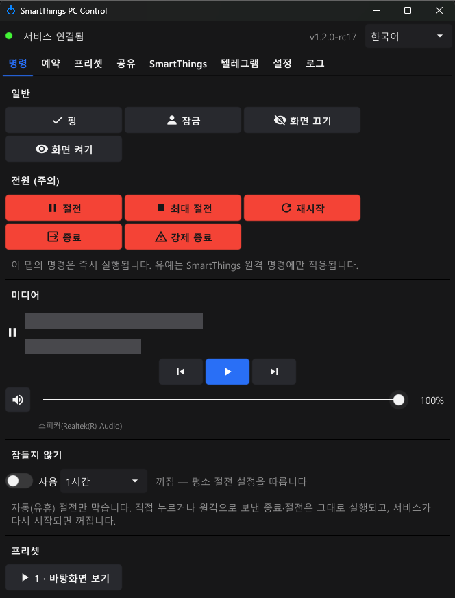
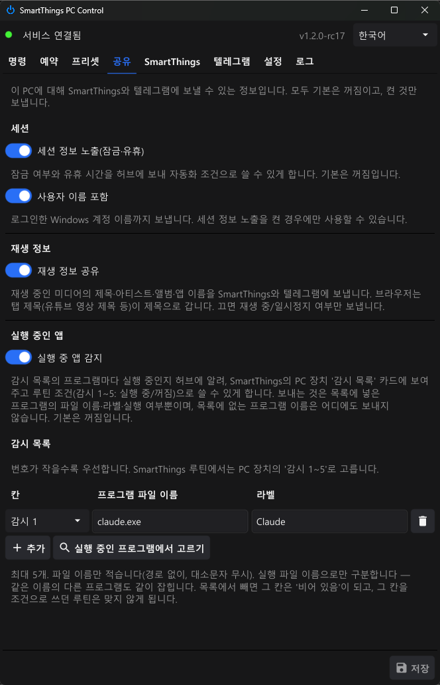

# SmartThings PC Control

**Windows PC 전원을 SmartThings와 텔레그램으로 제어하는 Windows 서비스 + 트레이 앱** 
Windows PC power control for SmartThings and Telegram: shutdown, restart, sleep, hibernate, lock, Wake-on-LAN, scheduling

[한국어](#한국어) · [English](#english)

 

---

## 한국어

exe 하나가 Windows 서비스(로그인 없이 항상 실행)와 트레이 앱을 겸합니다.
전용 SmartThings Edge 드라이버가 허브 안에서 로컬로 이 서비스와 이야기합니다.

### 무엇을 할 수 있나

- **전원 명령** — 종료 · 재시작 · 절전 · 최대 절전 · 잠금 · 화면 끄기/켜기. 원격 전원 명령은 유예(기본 5분) 뒤 실행되고 어디서든 취소할 수 있습니다.
- **실제 전원 상태** — SmartThings 앱에 켜짐 · 절전 · 최대 절전 · 꺼짐 · 깨우는 중 · 종료 대기가 그대로 보입니다.
- **Wake-on-LAN과 예약** — 스위치를 켜면 PC를 깨웁니다. 5분부터 3일까지 예약하고 어디서든 취소합니다.
- **잠들지 않기** — 정한 시간 동안 자동 절전을 막습니다. 직접 보낸 종료·절전은 그대로 실행됩니다.
- **볼륨 · 음소거 · 미디어** — 볼륨과 음소거를 바꾸고 재생 · 일시정지 · 이전/다음 곡을 보냅니다. 재생 정보 공유는 옵트인입니다.
- **PC 알림** — SmartThings 루틴이나 텔레그램 `/say`로 PC 화면에 문구를 띄웁니다.
- **프리셋** — 앱에 등록한 프로그램 · URL · 스크립트(최대 10개)를 원격에서 슬롯 번호로 실행합니다.
- **실행 중 앱 감지(옵트인)** — 감시 목록(최대 5개)의 프로그램이 실행 중인지 PC 장치의 '감시 목록' 카드에 보여 주고, 감시 1~5 칸의 실행 중/꺼짐을 루틴 조건으로 씁니다.
- **노트북 배터리** — 잔량과 충전 상태를 SmartThings · 텔레그램 · 앱에 보여 줍니다.
- **텔레그램(선택)** — 봇으로 알림을 받고 `/status` `/shutdown 30` 같은 명령으로 제어합니다.
- **데스크톱 앱** — 명령 · 예약 · 프리셋 · 공유 · SmartThings · 텔레그램 · 설정 · 로그 탭, 한국어/English.
- **서명된 자동 업데이트** — 서명을 확인한 릴리스만 설치하고, 실패하면 되돌립니다.

볼륨 · 미디어 · PC 알림 · 프리셋은 PC에 로그인한 사용자가 있어야 동작합니다.

### 설치

1. [Releases](https://github.com/Protomothis/smartthings-pc-control/releases)에서 `smartthings-pc-control.exe`를 받아 고정된 폴더(권장 `C:\Program Files\SmartThings PC Control\`)에 둡니다.
2. exe를 실행하고 **설정 탭 → [설치]** → UAC 승인. 서비스, 자동 시작, 방화벽 규칙(TCP 5001, UDP 1900)이 만들어집니다.
3. 설정 탭에서 **시크릿**을 정하고 [저장]합니다.
4. 채널 **Protomothis** 초대 링크를 열고 [Enroll] → 허브 선택: <https://bestow-regional.api.smartthings.com/invite/Kr2zNWYgpp2A>
5. 채널의 **SmartThings PC Control** 드라이버를 [Install]합니다.
6. PC와 PC Control이 켜진 상태에서 SmartThings 앱 **[+] → 기기 추가 → 주변 기기 검색**. 장치를 추가하는 방법은 이 검색뿐입니다.
7. 생긴 장치의 설정에 **시크릿**을 넣습니다.

설치 폴더는 관리자 전용으로 잠깁니다(일반 사용자는 읽기·실행만).
설치 뒤에는 exe를 옮기지 말고, 관리자 권한 없이 고칠 파일(프리셋 스크립트 등)은 이 폴더에 두지 마세요.
드라이버는 서비스 v1.1.0 이상이 필요하고, 드라이버 1.1의 새 기능은 v1.2.0이 필요합니다.
허브와 PC는 같은 서브넷에 있어야 하고 네트워크 프로필은 **개인**이어야 합니다.

### 텔레그램 (선택)

[@BotFather](https://t.me/BotFather)로 봇을 만들고, 앱 **텔레그램 탭**에 토큰을 넣은 뒤 [Chat ID 찾기]로 채팅을 고릅니다.
포트 개방이나 웹훅은 필요 없습니다.
**봇 하나에 PC 하나**를 씁니다(같은 토큰을 공유하면 한 PC만 명령을 받습니다).
명령 목록은 Wiki [텔레그램](https://github.com/Protomothis/smartthings-pc-control/wiki/텔레그램)에 있습니다.

### 문제 해결

- **검색이 안 될 때** — 앱 **SmartThings 탭**의 검색 상태(응답기 · 방화벽 규칙 · 마지막 검색 요청 시각)부터 봅니다. 시각이 갱신되지 않으면 PC와 허브 사이 네트워크 문제입니다.
- **어느 장치가 어느 PC인지** — 장치 정보의 모델 `PC Control · <8자리>`가 SmartThings 탭의 **이 PC의 ID**와 같습니다.
- **WoL이 안 될 때** — SmartThings 탭의 **WoL 어댑터**에서 고른 랜카드와 그 WoL 상태를 확인합니다.
- **로그** — 서비스는 exe 옆 `service.log`(앱 로그 탭), 트레이는 `%LOCALAPPDATA%\SmartThings PC Control\gui.log`.
- **`config.json`을 직접 고칠 때** — 관리자 권한 편집기가 필요합니다. 키는 Wiki [설정 파일 레퍼런스](https://github.com/Protomothis/smartthings-pc-control/wiki/설정-파일-레퍼런스)에 있습니다.

더 많은 사례는 Wiki [문제 해결과 FAQ](https://github.com/Protomothis/smartthings-pc-control/wiki/문제-해결과-FAQ)에 있습니다.

### 보안

- 드라이버는 시크릿을 URL이 아니라 `X-PC-Secret` 헤더로 보냅니다. 시크릿이 비어 있으면 LAN의 누구나 PC를 제어할 수 있으니 꼭 정하세요.
- `smartthings.allowed_hubs`에 허브 IP를 넣으면 그 허브만 드라이버 API를 씁니다.
- 앱의 로컬 API는 `127.0.0.1:5002`에만 열립니다. 트레이는 관리자 계정일 때 시크릿 없이 로컬 로그인합니다.
- 브라우저 WebUI는 시크릿을 정하고 원격 접속을 켰을 때만 LAN에 열리고, 상태 · 전원 명령 · 예약 · 핵심 설정만 다룹니다.
- 시크릿이 든 `config.json`은 관리자만 읽습니다. 텔레그램 봇 토큰은 DPAPI로 암호화합니다.
- 앱 감지는 감시 목록에 넣은 프로그램만 보고하고, 다른 프로그램 이름은 저장 · 로그 · 전송하지 않습니다.
- 자동 업데이트는 Ed25519 매니페스트 서명과 exe의 SHA-256을 확인한 뒤에만 설치합니다.
- 예전 형식의 `/{secret}/{command}` 경로도 호환을 위해 남아 있습니다.

### 문서와 개발

- [Wiki](https://github.com/Protomothis/smartthings-pc-control/wiki): [설치와 첫 설정](https://github.com/Protomothis/smartthings-pc-control/wiki/설치와-첫-설정) · [SmartThings Edge 드라이버](https://github.com/Protomothis/smartthings-pc-control/wiki/SmartThings-Edge-드라이버) · [CLI와 API 레퍼런스](https://github.com/Protomothis/smartthings-pc-control/wiki/CLI와-API-레퍼런스)
- 변경 이력: [CHANGELOG](CHANGELOG.md) · [edge/CHANGELOG](edge/CHANGELOG.md)
- 개발: [CONTRIBUTING.md](CONTRIBUTING.md)(빌드 · 테스트 · 커밋 규칙), 드라이버는 [`edge/README.md`](edge/README.md), 설계는 [`docs/design/`](docs/design/)

지원 환경: Windows 10 · 11(데스크톱 앱은 OpenGL 2.0 필요).

---

## English

A single exe that runs as a Windows service (always on, no login needed) and a tray app.
A dedicated SmartThings Edge driver talks to it locally from the hub.

### What it does

- **Power commands** — shutdown, restart, sleep, hibernate, lock, screen off/on. Remote power commands wait out a grace period (5 min by default) and can be cancelled anywhere.
- **Real power state** in the SmartThings app, **Wake-on-LAN**, and **schedules** from 5 minutes to 3 days.
- **Keep awake** — hold off idle sleep for a while; shutdown and sleep you ask for still happen.
- **Volume, mute and media** — set volume and mute, send play/pause, stop, next and previous. Sharing what is playing is opt-in.
- **PC notifications** — a SmartThings routine or Telegram `/say` puts a line of text on the PC's screen.
- **Presets** — up to ten programs, URLs or scripts registered in the app, run remotely by slot number.
- **Running-app detection (opt-in)** — up to five watched apps appear on the PC device's "Watch list" card; routines use "Watch 1"–"Watch 5" (running/stopped).
- **Laptop battery** level and charging state, **Telegram** (optional), a Korean/English **desktop app**, and **signed auto-update**.

Volume, media, notifications and presets need a signed-in user on the PC.

### Install

1. Download `smartthings-pc-control.exe` from [Releases](https://github.com/Protomothis/smartthings-pc-control/releases) into a permanent folder of its own.
2. Run it → **Settings → [Install]** (UAC). This creates the service and firewall rules for TCP 5001 and UDP 1900. Set a **secret** and save.
3. Open the **Protomothis** channel invite <https://bestow-regional.api.smartthings.com/invite/Kr2zNWYgpp2A>, enroll your hub, and install **SmartThings PC Control**.
4. With the PC on and PC Control running, tap **[+] → Add device → Scan nearby** in the SmartThings app. This is the only way to add the device. Enter the secret in the device settings.

The install folder is restricted to administrators; editing `config.json` by hand needs an elevated editor.
The driver needs service v1.1.0+, and v1.2.0 for the driver 1.1 features.
Hub and PC must share a subnet on a **Private** network profile.
The app's tabs are Commands, Schedule, Presets, Sharing, SmartThings, Telegram, Settings and Logs.

### Troubleshooting and security

If discovery finds nothing, check the discovery status and last search request on the **SmartThings** tab.
Logs: `service.log` next to the exe (Logs tab) and `%LOCALAPPDATA%\SmartThings PC Control\gui.log`.
The driver sends the secret in the `X-PC-Secret` header; an empty secret lets anyone on the LAN control the PC.
The local API binds to `127.0.0.1:5002`, and the WebUI opens to the LAN only when you enable remote access with a secret set.
Running-app detection reports only programs on your watch list.
Updates install only after the Ed25519 manifest signature and the exe's SHA-256 check out.

### Docs

The [Wiki](https://github.com/Protomothis/smartthings-pc-control/wiki) has the guides ([English overview](https://github.com/Protomothis/smartthings-pc-control/wiki/Home-EN); most pages are Korean).
Developers: [CONTRIBUTING.md](CONTRIBUTING.md) and [`edge/README.md`](edge/README.md).

---

## License

[MIT](LICENSE)
