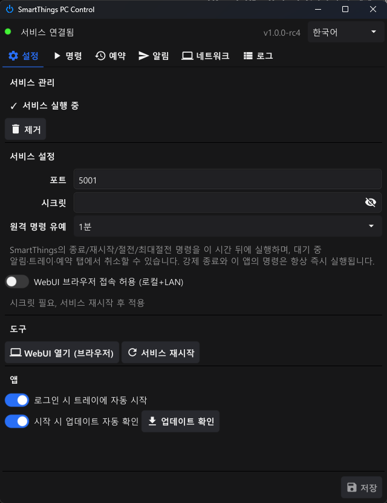
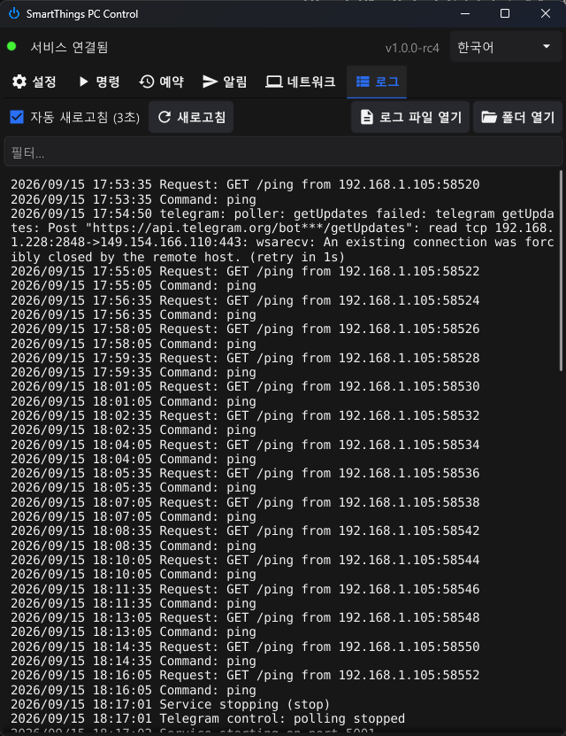

<div align="center">

# SmartThings PC Control

**Windows PC 전원을 SmartThings와 텔레그램으로 제어하는 Windows 서비스 + 트레이 앱**<br>
<sub>Windows PC power control for SmartThings and Telegram: shutdown, restart, sleep, hibernate, lock, Wake-on-LAN, scheduling</sub>

[](https://github.com/Protomothis/smartthings-pc-control/releases)
[](https://go.dev)
[](LICENSE)
[](https://www.microsoft.com/windows)

[한국어](#한국어) · [English](#english)

 

</div>

---

## 한국어

단일 exe 하나가 Windows 서비스(로그인 없이 항상 실행)와 트레이 앱을 겸하고, 전용 SmartThings Edge 드라이버가 허브 안에서 로컬로 이 서비스와 이야기합니다.

### 무엇을 할 수 있나

- **전원 명령** — 종료 · 재시작 · 절전 · 최대 절전 · 잠금 · 화면 끄기/켜기 · 강제 종료. 원격 전원 명령은 유예(기본 5분) 뒤 실행되고 어디서든 취소할 수 있습니다.
- **실제 전원 상태** — SmartThings 앱에 켜짐 · 절전 · 최대 절전 · 꺼짐 · 깨우는 중 · 종료 대기가 그대로 보이고, 서비스가 종료·절전 직전에 허브로 푸시합니다.
- **Wake-on-LAN** — 스위치를 켜면 PC가 고른 어댑터의 MAC으로 매직 패킷을 보냅니다.
- **예약** — 5분부터 3일까지 프리셋 16개, 취소 포함. SmartThings · 앱 · 텔레그램 어디서 건 예약이든 모든 곳에 같이 보입니다.
- **전환 중 보호** — PC가 꺼지거나 켜지는 동안에는 명령 목록이 `종료 진행 중…`처럼 바뀌고 명령을 보내지 않습니다.
- **잠들지 않기** — 정한 시간(기본 1시간, 최대 24시간 또는 끌 때까지) 동안 자동 절전을 막습니다. 직접 보낸 종료·절전은 그대로 실행됩니다. 기본 시간은 `config.json`의 `awake.default_minutes`(0 = 끌 때까지), 화면까지 켜 두려면 `awake.keep_display: true`.
- **노트북 배터리** — 배터리가 있는 PC는 잔량과 충전 상태를 SmartThings · 텔레그램 `/status` · 앱 상태 줄에 보고합니다.
- **실행 중 앱 감지(선택)** — 감시 목록에 넣은 프로그램이 실행 중이면 `게임 중 · Steam`처럼 종류와 라벨을 SmartThings · 텔레그램 `/status`에 알립니다. 기본은 꺼짐이고, 앱의 네트워크 탭 SmartThings 섹션에서 켜고 목록을 편집합니다(실행 중인 프로그램에서 고르기 지원). `config.json`에서는 `activity: { enabled, watch: [{ process: "steam.exe", label: "Steam", kind: "game" }] }` — `process`는 경로 없는 `.exe` 파일 이름(대소문자 무시), `label`은 30자 이하, `kind`는 `game` · `stream` · `media` · `work` · `other`, 최대 20개입니다.
- **볼륨 · 음소거 · 미디어** — 기본 재생 장치의 볼륨(0–100, 올리기/내리기 기본 5)과 음소거를 바꾸고 현재 값을 보고하며, 재생/일시정지 · 정지 · 다음/이전 곡 키를 보냅니다. 로그인한 사용자가 있을 때만 동작합니다(없으면 `409 no_user_session`). Windows에는 재생/일시정지 토글 키 하나뿐이라 `play`와 `pause`는 둘 다 그 키를 보냅니다. `/st/v1/command`의 `volume`(value 0–100) · `volumeup`/`volumedown`(value 1–100, 기본 5) · `mute` · `unmute` · `play` · `pause` · `playpause` · `stop` · `next` · `prev`. 끄려면 `config.json`의 `media.enabled: false`(기본 켬, 앱 설정 탭에도 있음).
- **텔레그램** — 봇으로 알림을 받고 `/status` `/shutdown 30` 같은 명령으로 제어합니다(선택).
- **데스크톱 앱** — 설정 · 명령 · 예약 · 알림 · 네트워크 · 로그 탭, 트레이 상주, 한국어/English.
- **서명된 자동 업데이트** — Ed25519 서명 매니페스트로 검증한 릴리스만 설치하고, 실패하면 롤백합니다.

### 설치

**1. Windows 앱 설치와 설정**

1. [Releases](https://github.com/Protomothis/smartthings-pc-control/releases)에서 `smartthings-pc-control.exe`를 받아 고정된 폴더에 둡니다(권장 `C:\Program Files\SmartThings PC Control\`). 설정 `config.json`과 로그 `service.log`가 exe 옆에 생기므로 설치 뒤에는 exe를 옮기지 마세요.
2. exe를 실행하고 **설정 탭 → [설치]** → UAC 승인. CLI로는 관리자 권한에서 `smartthings-pc-control.exe install`입니다. 서비스 등록, 자동 시작, 방화벽 인바운드 규칙(TCP 5001, UDP 1900)이 함께 만들어집니다.
3. 설정 탭에서 **시크릿**을 정하고 [저장]합니다.

**2. 채널 가입과 드라이버 설치**

1. 채널 **Protomothis** 초대 링크를 열고 [Enroll] → 허브 선택: <https://bestow-regional.api.smartthings.com/invite/Kr2zNWYgpp2A>
2. 채널의 **SmartThings PC Control** 드라이버를 [Install]합니다.

**3. SmartThings 앱에서 [주변 기기 검색]**

1. **PC가 켜져 있고 PC Control이 돌고 있는 상태에서** SmartThings 앱 **[+] → 기기 추가 → 주변 기기 검색**을 누릅니다. 장치를 추가하는 방법은 이 검색뿐입니다.
2. IP · 포트 · 호스트 이름이 채워진 채 장치가 생기므로, 장치 설정에 **시크릿만** 넣으면 끝입니다.
3. 장치 정보의 모델 `PC Control · <id 8자리>`는 앱 네트워크 탭의 **이 PC의 ID**와 같은 값이라, PC가 여럿일 때 어느 장치가 어느 PC인지 여기서 맞춰 봅니다.

드라이버는 서비스 **v1.1.0 이상**이 필요하고, **v1.1.1**을 권장합니다(네트워크 탭의 검색 상태 표시와 WoL 어댑터 선택). 허브와 PC는 같은 서브넷에 있어야 하고 네트워크 프로필은 **개인**이어야 합니다. 검색이 안 되면 앱 **네트워크 탭 → SmartThings**의 검색 상태와 마지막 검색 요청 시각부터 확인하세요.

### 텔레그램 (선택)

[@BotFather](https://t.me/BotFather)로 봇을 만들고, 앱 **알림 탭**에 토큰을 넣은 뒤 [Chat ID 찾기]로 채팅을 고릅니다. 알림과 명령 제어는 각각 따로 켭니다. 포트 개방이나 웹훅은 필요 없고, **봇 하나에 PC 하나**를 씁니다(같은 토큰을 공유하면 한 PC만 명령을 받습니다).

볼륨과 미디어 명령은 `/vol`(현재 값: `볼륨 30% · 음소거 꺼짐 · 스피커`) · `/vol 30` · `/vol +10` · `/vol -10` · `/mute` · `/unmute` · `/play` · `/pause` · `/stop` · `/next` · `/prev`입니다. 알림 일시 중지는 `/quiet 30m|2h|off`로 옮겼고, `/mute 2h`처럼 시간을 붙이면 예전처럼 알림을 멈춥니다.

### 문서

자세한 안내는 [Wiki](https://github.com/Protomothis/smartthings-pc-control/wiki)에 있습니다.

- [설치와 첫 설정](https://github.com/Protomothis/smartthings-pc-control/wiki/설치와-첫-설정)
- [SmartThings Edge 드라이버](https://github.com/Protomothis/smartthings-pc-control/wiki/SmartThings-Edge-드라이버) · 개발자용 [`edge/README.md`](edge/README.md)
- [텔레그램](https://github.com/Protomothis/smartthings-pc-control/wiki/텔레그램)
- [문제 해결과 FAQ](https://github.com/Protomothis/smartthings-pc-control/wiki/문제-해결과-FAQ)
- 참고: [설정 파일 레퍼런스](https://github.com/Protomothis/smartthings-pc-control/wiki/설정-파일-레퍼런스) · [CLI와 API 레퍼런스](https://github.com/Protomothis/smartthings-pc-control/wiki/CLI와-API-레퍼런스) · [CHANGELOG](CHANGELOG.md) · [edge/CHANGELOG](edge/CHANGELOG.md)

### 개발

Fyne GUI 때문에 CGO와 MinGW-w64 gcc가 필요합니다.

```bash
CGO_ENABLED=1 go vet ./... && CGO_ENABLED=1 go test ./...
CGO_ENABLED=1 go build -ldflags="-s -w -H=windowsgui -X main.Version=dev" -o smartthings-pc-control.exe .
cd edge && npm install && npm test      # Lua 5.3 테스트를 fengari로 실행
```

CI는 push와 PR마다 vet · test · 빌드(`ci.yml`)와 `edge/**` 변경의 Lua 테스트(`edge.yml`)를 돌립니다. `v*` 태그는 앱을 빌드·서명해 릴리스하고(`release.yml`), `edge-vX.Y.Z` 태그는 드라이버를 패키징해 채널에 배정합니다. 드라이버 설계는 [`docs/design/edge-driver.md`](docs/design/edge-driver.md)에 있습니다.

### 보안

SmartThings 명령은 포트 5001에서 받고, 드라이버는 시크릿을 URL이 아니라 `X-PC-Secret` 헤더로 보냅니다. 시크릿이 비어 있으면 LAN의 누구나 PC를 제어할 수 있으니 꼭 정하세요. `smartthings.allowed_hubs`에 허브 IP를 넣으면 그 허브만 드라이버 API를 쓸 수 있습니다(비어 있으면 모두 허용). 앱이 쓰는 로컬 API는 `127.0.0.1:5002`에만 열리고, 브라우저 WebUI는 시크릿을 정한 뒤 직접 켰을 때만 LAN에 열립니다. 텔레그램 봇 토큰은 DPAPI로 암호화해 저장합니다. 실행 중 앱 감지는 켰을 때만 10초마다 프로세스 이름을 감시 목록과 비교하고, 밖으로 나가는 것은 일치한 항목의 종류와 라벨뿐입니다 — 목록에 없는 프로그램 이름은 저장하지도, 로그에 남기지도, 보내지도 않습니다. 목록 편집기의 "실행 중인 프로그램에서 고르기"가 쓰는 이름 목록(`/api/processes`)은 이 PC(루프백)에서 로그인한 앱에만 답합니다. 자동 업데이트는 내장 공개키로 Ed25519 매니페스트 서명과 exe의 SHA-256을 확인한 뒤에만 설치합니다. 예전 형식의 `/{secret}/{command}` 경로도 호환을 위해 남아 있습니다.

지원 환경: Windows 10 · 11(데스크톱 앱은 OpenGL 2.0 필요).

---

## English

A single exe that runs as a Windows service (always on, no login needed) and a tray app, plus a dedicated SmartThings Edge driver that talks to it locally from the hub.

### What it does

- **Power commands** — shutdown, restart, sleep, hibernate, lock, screen off/on, force shutdown. Remote power commands wait out a grace period (5 min by default) and can be cancelled anywhere.
- **Real power state** in the SmartThings app: on, sleeping, hibernated, off, waking, shutting down, pushed to the hub right before the PC goes down.
- **Wake-on-LAN** to the adapter the PC picks, **scheduling** with 16 presets up to 3 days (with cancel), and a command list that knows when the PC is mid-transition.
- **Keep awake** — hold off idle sleep for a while (1 hour by default, up to 24 hours or until turned off); shutdown and sleep you ask for still happen. `awake.default_minutes` (0 = until turned off) and `awake.keep_display` in `config.json`. Laptops also report their **battery** level and charging state.
- **Running-app detection (opt-in)** — when a program on your watch list runs, the hub and Telegram `/status` see its kind and your label ("Gaming · Steam"). Off by default; turn it on and edit the list in the app's network tab (with a picker of running programs). In `config.json`: `activity: { enabled, watch: [{ process: "steam.exe", label: "Steam", kind: "game" }] }` — `process` is a bare `.exe` file name (case-insensitive), `label` up to 30 characters, `kind` one of `game`, `stream`, `media`, `work`, `other`, at most 20 entries.
- **Volume, mute and media keys** — set and report the default playback device's volume (0–100, up/down by 5 by default) and mute, and send play/pause, stop, next and previous. Needs a logged-in user (`409 no_user_session` otherwise). Windows has a single play/pause toggle, so `play` and `pause` both send it. `/st/v1/command`: `volume` (value 0–100), `volumeup`/`volumedown` (value 1–100, default 5), `mute`, `unmute`, `play`, `pause`, `playpause`, `stop`, `next`, `prev`. Turn it off with `media.enabled: false` in `config.json` (on by default; also on the app's Settings tab).
- **Telegram** notifications and bot commands (optional), a **desktop app** in Korean/English, and **signed auto-update** (Ed25519 manifest, rollback on failure).

### Install

1. **Windows app** — download `smartthings-pc-control.exe` from [Releases](https://github.com/Protomothis/smartthings-pc-control/releases) into a permanent folder (`config.json` lives next to it). Run it → **Settings → [Install]** (or `smartthings-pc-control.exe install` as admin). This creates the service and firewall rules for TCP 5001 and UDP 1900. Set a **secret** and save.
2. **Channel and driver** — open the **Protomothis** channel invite <https://bestow-regional.api.smartthings.com/invite/Kr2zNWYgpp2A>, enroll your hub, and install **SmartThings PC Control**.
3. **Scan nearby** — with the PC on and PC Control running, tap **[+] → Add device → Scan nearby** in the SmartThings app. This is the only way to add the device. Enter the secret in the device settings. The device model `PC Control · <8-char id>` matches **This PC's ID** on the app's Network tab.

The driver needs service **v1.1.0+**; **v1.1.1** is recommended (discovery status and WoL adapter choice on the Network tab). Hub and PC must share a subnet on a **Private** network profile.

### Telegram (optional)

Create a bot with [@BotFather](https://t.me/BotFather), paste the token on the **Notifications** tab and use [Find Chat ID]. Notifications and control are enabled separately. No open ports or webhooks; use **one bot per PC**.

Volume and media: `/vol` (current: `Volume 30% · mute off · Speakers`), `/vol 30`, `/vol +10`, `/vol -10`, `/mute`, `/unmute`, `/play`, `/pause`, `/stop`, `/next`, `/prev`. Pausing notifications moved to `/quiet 30m|2h|off`; `/mute 2h` with a duration still pauses them.

### Docs

The [Wiki](https://github.com/Protomothis/smartthings-pc-control/wiki) has the guides ([English overview](https://github.com/Protomothis/smartthings-pc-control/wiki/Home-EN); most pages are Korean): [설치와 첫 설정](https://github.com/Protomothis/smartthings-pc-control/wiki/설치와-첫-설정) (install), [SmartThings Edge 드라이버](https://github.com/Protomothis/smartthings-pc-control/wiki/SmartThings-Edge-드라이버) (Edge driver), [텔레그램 알림 설정](https://github.com/Protomothis/smartthings-pc-control/wiki/텔레그램) (Telegram), [문제 해결과 FAQ](https://github.com/Protomothis/smartthings-pc-control/wiki/문제-해결과-FAQ) (troubleshooting). Driver developers: [`edge/README.md`](edge/README.md).

### Development

CGO and MinGW-w64 gcc are required (Fyne GUI). `go vet ./... && go test ./...` and the `go build` line above; `cd edge && npm install && npm test` runs the Lua 5.3 suite under fengari. CI runs both on every push and PR; a `v*` tag builds, signs and releases the app, and an `edge-vX.Y.Z` tag packages the driver and assigns it to the channel.

### Security

The driver sends the secret in the `X-PC-Secret` header, never in the URL; an empty secret lets anyone on the LAN control the PC. `smartthings.allowed_hubs` restricts the driver API to listed hub IPs (empty allows any). The app's local API binds to `127.0.0.1:5002`; the browser WebUI opens to the LAN only when you enable it with a secret set. The bot token is DPAPI-encrypted. Running-app detection, when on, compares process names with the watch list every 10 seconds and sends only the matching entries' kinds and labels; names of programs not on the list are never stored, logged or sent. The name list behind the app's picker (`/api/processes`) answers the signed-in app on this PC (loopback) only. Updates install only after the Ed25519 manifest signature and the exe's SHA-256 check out.

---

## License

[MIT](LICENSE)
